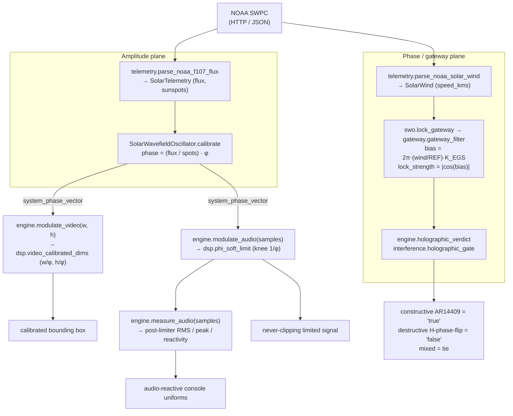

# Architecture

SynthOBS is three layers around one constant. Each layer is independently testable,
and each scales against **φ** from a single definition site within that layer. The
layers mirror one another deliberately: the Python engine is the specification, the C
plugin is the production transducer, and the obspython script is the bridge.

```
                  ┌───────────────────────────────────────────────────┐
                  │   φ = (1 + √5) / 2   —  El Gran Sol's Fractal      │
                  │   Constant (the golden-ratio LAYOUT constant)     │
                  └───────────────────────────────────────────────────┘
                          │                               │
        defined once as   │                               │   pinned once as
        PHI in            ▼                               ▼   #define EGS_PHI
        ┌──────────────────────────────┐       ┌──────────────────────────────┐
        │ LAYER 1 — Python engine      │ mirror│ LAYER 2 — native libobs      │
        │ src/synthobs/                │◀─────▶│ plugin                       │
        │ source of truth              │ ISC-60│ plugin/fractisynth/src/      │
        │ 1132 tests, no mocks         │       │ fractisynth.c (loads in OBS) │
        └──────────────────────────────┘       └──────────────────────────────┘
                          ▲                               ▲
            drives the    │                               │   registers the two
            real engine   │                               │   OBS filters
            via           │                               │
                  ┌───────┴───────────────────────────────┴───────┐
                  │ LAYER 3 — obspython bridge                     │
                  │ plugin/synthobs/synthobs_console.py            │
                  └───────────────────────────────────────────────┘
```

## Layer 1 — the Python engine (`src/synthobs/`)

The engine is the **source of truth**. It has zero OBS dependency and zero network
dependency in its core, which is exactly what makes it testable without mocks. Thirteen
modules, each one responsibility:

| Module            | Responsibility                                                                                              |
| ----------------- | ----------------------------------------------------------------------------------------------------------- |
| `constants.py`    | Single definition of `PHI`, its derived ratios, and the EGS gateway anchors (`EGS_GATEWAY_KEY`). Zero I/O.   |
| `layout.py`       | Goldilocks golden split, recursive subdivision, golden spiral, viewport assembly.                           |
| `telemetry.py`    | Fail-closed NOAA SWPC client + payload parsing. Raises `TelemetryUnavailable` on anything malformed.         |
| `swo.py`          | Solar Wavefield Oscillator — derives the phase vector, **holds** the last good value on bad input.          |
| `gateway.py`      | El Gran Sol gateway — locks the **phase plane** from solar wind via `K_EGS`; `lock_strength = \|cos(bias)\|`. |
| `interference.py` | Holographic interference gate (non-Boolean) + Recursive Sourced Interference (RSI) step.                    |
| `dsp.py`          | φ-calibrated video dimensions, the spatial scale matrix, the φ-knee soft limiter.                           |
| `console.py`      | The three operator modes and the 7-button console with its safety button per mode.                          |
| `commands.py`     | The terminal grammar parser (`parse`). Fails closed (`CommandError`) on unknown verbs / bad values.          |
| `interaction.py`  | Seven feed-tab targets, layer-toggle rail geometry, and marker-drop resolution.                             |
| `layers.py`       | Deterministic OBS dashboard/layer plans for Wavefield, Telemetry HUD, and Solar Graph metrics.              |
| `engine.py`       | `SynthEngine` — orchestrates calibration, layout, and modulation; refuses to modulate before calibration.    |
| `__init__.py`     | Public package surface.                                                                                      |

Full API in [engine.md](engine.md). The two phase-plane modules have their own
deep-dives: [egs-gateway.md](egs-gateway.md) and [interference.md](interference.md).

## Formal scaffold (`lean/`)

Lean is used as a buildable invariant ledger, not as the runtime engine. The
`lean/SynthOBS/Invariants.lean` project proves console-shape facts (3 modes, 3 common
ids, 4 unique ids per mode, 7 buttons per mode, disjoint unique ids, safety buttons),
literal pins, SWO fail-closed predicates, and the provenance readiness gate. The build
is small and dependency-free:

```bash
cd lean
lake build
```

See [formal-invariants.md](formal-invariants.md).

## Layer 2 — the native plugin (`plugin/fractisynth/`)

A real `libobs` plugin in C that registers two OBS filters (`fractisynth_video` and
`fractisynth_audio`). It is a **faithful mirror** of Layer 1: the φ literal, the SWO
phase formula `φ · (flux / spots)`, and the fail-closed rule are identical. It owns
one extra responsibility the pure-Python engine cannot: a background **libcurl
telemetry thread** that polls live NOAA SWPC from inside the OBS process.

This layer is verified to load in **OBS 32.1.2**. Details and the live load log are in
[native-plugin.md](native-plugin.md) and [build-and-install.md](build-and-install.md).

## Layer 3 — the obspython bridge (`plugin/synthobs/synthobs_console.py`)

A standard OBS Python script. It guards its `import obspython` so it remains importable
(and testable) outside OBS, and it drives the **real Python engine** via
`apply_command`, mapping operator actions (mode switches, transducer binds, SWO
calibration) onto the engine's typed command grammar. This keeps the scriptable
control surface honest: it cannot do anything the tested engine cannot do.

## The single-source-of-truth invariant

The defining architectural rule: **φ is defined once per layer, and the layers are
pinned to each other.** Python's `constants.PHI` is the canonical value;
`constants.PHI_C_LITERAL = "1.61803398875"` records exactly what the C plugin
hard-codes; a test (`ISC-60`) asserts the C literal matches `PHI` to ≥9 significant
digits. Drift between the engine and the transducer is therefore a **test failure**,
not a silent bug.

The same fail-closed philosophy runs through every layer:

- **Telemetry** raises rather than substituting a default (`telemetry.py`).
- **The oscillator** holds its last verified vector rather than calibrating on bad data (`swo.py`).
- **The gateway** raises on a non-positive wind speed; the SWO catches it and holds the last lock (`gateway.py`, `swo.lock_gateway`).
- **The engine** raises rather than modulating before it has ever calibrated (`engine.py`).
- **The grammar** raises rather than no-oping on an unknown verb (`commands.py`).
- **The C plugin** holds its last vector on any curl/parse error (`fractisynth.c`).

There is no path where bad input quietly produces plausible-looking output. That is the
point of the design.

## Data flow at runtime

The engine locks two independent planes. The **amplitude plane** comes from F10.7
flux and active-sunspot count; the **phase (gateway) plane** comes from live solar
wind. Each fails closed and holds independently — a dropout on one never disturbs
the other.



Inside OBS the same flow runs natively: the libcurl thread replaces the Python
telemetry fetch, `synchronize_swo_calibration` replaces `calibrate`, and the two OBS
filters (`fractisynth_video` / `fractisynth_audio`) replace `modulate_video` /
`modulate_audio`.
