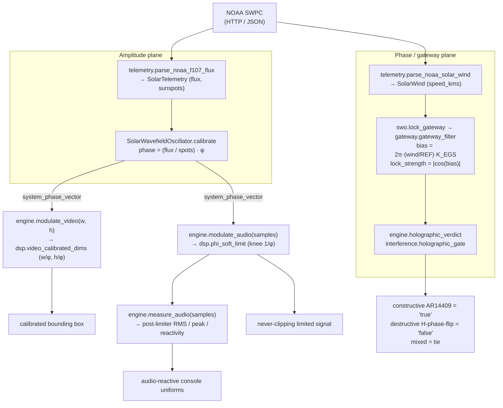

# Architecture

SynthOBS has three independently testable layers around two pinned constants with
separate roles. The Python engine defines the portable contracts, the C plugin
implements native counterparts at the OBS boundary, and the obspython script is the
bridge. The adapters are checked against the engine; they do not duplicate every
Python operation that has no OBS-bound equivalent.

{#fig:docs-architecture-layers width=90%}

## Layer 1 — the Python engine (`src/synthobs/`)

The engine is the **source of truth**. It has zero OBS dependency and zero network
dependency in its core, which is exactly what makes it testable without external services. Fifteen
public modules plus the package initializer, each with one responsibility:

| Module            | Responsibility                                                                                              |
| ----------------- | ----------------------------------------------------------------------------------------------------------- |
| `constants.py`    | Single definition of `PHI`, its derived ratios, and the EGS gateway anchors (`EGS_GATEWAY_KEY`). Zero I/O.   |
| `layout.py`       | Goldilocks golden split, recursive subdivision, golden spiral, viewport assembly.                           |
| `telemetry.py`    | Fail-closed NOAA SWPC client + payload parsing. Raises `TelemetryUnavailable` on anything malformed.         |
| `swo.py`          | Solar Wavefield Oscillator — derives the phase vector, **holds** the last good value on bad input.          |
| `gateway.py`      | El Gran Sol gateway — locks the **phase plane** from solar wind via `K_EGS`; `lock_strength = \|cos(bias)\|`. |
| `interference.py` | Holographic interference gate (non-Boolean) + Recursive Sourced Interference (RSI) step.                    |
| `dsp.py`          | φ-calibrated video dimensions, the spatial scale matrix, the φ-knee soft limiter.                           |
| `console.py`      | The three operator modes and the 7-button console with its safety button per mode.                          |
| `commands.py`     | The terminal grammar parser (`parse`). Fails closed (`CommandError`) on unknown verbs / bad values.          |
| `interaction.py`  | Seven feed-tab targets, layer-toggle rail geometry, and marker-drop resolution.                             |
| `layers.py`       | Deterministic OBS dashboard/layer plans for Wavefield, Telemetry HUD, and Solar Graph metrics.              |
| `history.py`      | Bounded telemetry history ring buffer feeding the HUD waveform sparklines (mirrors the C ring).             |
| `provenance.py`   | Telemetry-record packing, default unkeyed corruption-detecting checksum, opt-in HMAC-SHA-256 authenticity, LSB/visible-signature embedding, and fail-closed validation. |
| `engine.py`       | `SynthEngine` — orchestrates calibration, layout, and modulation; refuses to modulate before calibration.    |
| `verification.py` | Pure live-gate oracle: audio-meter ROI scoring (`uv.y > 0.955`) and `GateResult` pass/fail/skip contracts.   |
| `__init__.py`     | Public package surface.                                                                                      |

Full API in [engine.md](engine.md). The two phase-plane modules have their own
deep-dives: [egs-gateway.md](egs-gateway.md) and [interference.md](interference.md).

## Formal scaffold (`lean/`)

Lean is used as a buildable invariant ledger, not as the runtime engine. The
`lean/SynthOBS/Invariants.lean` project proves console-shape facts (3 modes, 3 common
ids, 4 unique ids per mode, 7 buttons per mode, disjoint unique ids, safety buttons),
literal pins, SWO fail-closed predicates, and the provenance readiness gate. The build
is small and dependency-free:

```bash
cd lean
lake build
```

See [formal-invariants.md](formal-invariants.md).

## Layer 2 — the native plugin (`plugin/fractisynth/`)

A real `libobs` plugin in C that registers three OBS filters (`fractisynth_video`,
`fractisynth_audio`, and `fractisynth_inspector`) plus the generated
`fractisynth_console` source. It implements selected Layer 1 contracts: the φ literal,
the SWO phase formula `φ · (flux / spots)`, and the fail-closed rule are pinned by
static and behavioral checks. It owns one extra responsibility the pure-Python engine
cannot: a background **libcurl telemetry thread** that polls live NOAA SWPC from
inside the OBS process.

This layer is verified to load in **OBS 32.1.2**. Details and the live load log are in
[native-plugin.md](native-plugin.md) and [build-and-install.md](build-and-install.md).

## Layer 3 — the obspython bridge (`plugin/synthobs/synthobs_console.py`)

A standard OBS Python script. It guards its `import obspython` so it remains importable
(and testable) outside OBS, and it drives the **real Python engine** via
`apply_command`, mapping operator actions (mode switches, transducer binds, SWO
calibration) onto the engine's typed command grammar. This keeps the scriptable
control surface honest: it cannot do anything the tested engine cannot do.

## The single-source-of-truth invariant

The defining architectural rule: **φ is defined once per layer, and the layers are
pinned to each other.** Python's `constants.PHI` is the canonical value;
`constants.PHI_C_LITERAL = "1.61803398875"` records exactly what the C plugin
hard-codes; a test (`ISC-60`) asserts the C literal matches `PHI` to ≥9 significant
digits. Drift between the engine and the transducer is therefore a **test failure**,
not a silent bug.

The same fail-closed philosophy runs through every layer:

- **Telemetry** raises rather than substituting a default (`telemetry.py`).
- **The oscillator** holds its last verified vector rather than calibrating on bad data (`swo.py`).
- **The gateway** raises on a non-positive wind speed; the SWO catches it and holds the last lock (`gateway.py`, `swo.lock_gateway`).
- **The engine** raises rather than modulating before it has ever calibrated (`engine.py`).
- **The grammar** raises rather than no-oping on an unknown verb (`commands.py`).
- **The C plugin** holds its last vector on any curl/parse error (`fractisynth.c`).

There is no path where bad input quietly produces plausible-looking output. That is the
point of the design.

## Data flow at runtime

The engine locks two independent planes. The **amplitude plane** comes from F10.7
flux and active-sunspot count; the **phase (gateway) plane** comes from live solar
wind. Each fails closed and holds independently — a dropout on one never disturbs
the other.



Inside OBS the same flow runs natively: the libcurl thread replaces the Python
telemetry fetch, `synchronize_swo_calibration` replaces `calibrate`, and the video and
audio filters (`fractisynth_video` / `fractisynth_audio`) replace `modulate_video` /
`modulate_audio`; the inspector is an independent video filter over the same source
boundary.
