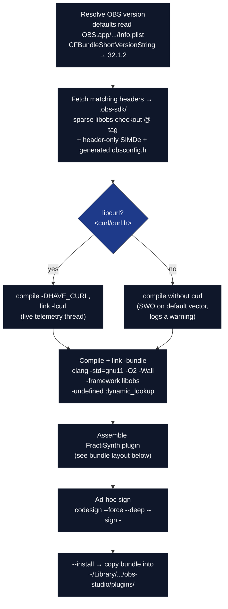

# Building & Installing the Native Plugin

The FractiSynth C plugin builds against your **installed OBS.app** on macOS and has been
verified to load live in **OBS 32.1.2**. This page is the build, install, and
verification guide.

## Quick path (macOS)

```bash
cd plugin/fractisynth
./build.sh --install     # build + ad-hoc sign + install into your OBS plugins dir
# then restart OBS
```

That single command does everything below. Read on for what it does and how to verify.

## What `build.sh` does

[`plugin/fractisynth/build.sh`](../plugin/fractisynth/build.sh) links **directly against
`/Applications/OBS.app`'s `libobs.framework`**, using libobs C headers cloned at the
exact installed OBS tag so the ABI matches.



Step detail (numbers match the comment headers in `build.sh`):

| # | Step | What it does |
| --- | --- | --- |
| — | **Resolve OBS version** | `defaults read OBS.app/Contents/Info.plist CFBundleShortVersionString` (e.g. `32.1.2`; falls back to `32.1.2`). Override the app location with `OBS_APP=/path/to/OBS.app`. |
| 1 | **Fetch matching headers** | A sparse `libobs` checkout of `obs-studio` at that tag into `.obs-sdk/obs-studio`, plus header-only SIMDe into `.obs-sdk/simde`, plus a minimal generated `obsconfig.h`. Cached after the first run. |
| — | **Detect libcurl** | If `<curl/curl.h>` resolves, compiles with `-DHAVE_CURL` and links `-lcurl` (live telemetry thread). Otherwise the oscillator runs on its default vector and logs a warning — the plugin still builds and loads. |
| 2 | **Compile + link** | `clang -c … -fPIC -std=gnu11 -O2 -Wall`, then `clang -bundle … -framework libobs` with `-Wl,-undefined,dynamic_lookup`. |
| 3 | **Assemble the bundle** | Builds `FractiSynth.plugin` (layout below), including the `Info.plist` with `CFBundleIdentifier institute.activeinference.fractisynth` and version `1.618.0`. |
| 4 | **Ad-hoc sign** | `codesign --force --deep --sign -` so a hardened OBS will load a local dev plugin. |
| 5 | **`--install`** | Copies the bundle to `~/Library/Application Support/obs-studio/plugins/FractiSynth.plugin`. |

### Bundle layout

`build.sh` assembles the macOS plugin bundle as:

```
FractiSynth.plugin/
└── Contents/
    ├── Info.plist                     CFBundleIdentifier institute.activeinference.fractisynth
    │                                   CFBundleExecutable FractiSynth · version 1.618.0
    ├── MacOS/
    │   └── FractiSynth                 the linked -bundle Mach-O
    └── Resources/
        ├── locale/
        │   └── en-US.ini               filter display-name strings
        ├── fractisynth.effect          φ video-calibration shader
        └── fractisynth_console.effect  wavefield-console shader
```

Both `data/*.effect` files and the `data/locale` directory are copied into
`Contents/Resources/`.

### Requirements

`clang`, `git`, an installed `OBS.app`, and (optional, for live telemetry) `libcurl`
(ships with macOS). No Homebrew OBS dev package required — the build bootstraps the
headers itself.

## Cross-platform path (CMake)

[`CMakeLists.txt`](../plugin/fractisynth/CMakeLists.txt) follows the obs-studio in-tree
plugin convention for Linux/Windows or an in-tree OBS build:

```bash
cmake -B build -DCMAKE_BUILD_TYPE=Release
cmake --build build
```

It requires the `OBS::libobs` target (from an in-tree build or the OBS plugin SDK) and
optionally `CURL::libcurl` (compiles `HAVE_CURL` when found). On Linux (`UNIX AND NOT
APPLE`) it also links `m` for `tanhf`/`isfinite`.

## Verifying the install

The gold standard is OBS's own module log. After installing and starting OBS, open the
newest log under `~/Library/Application Support/obs-studio/logs/` and look for:

```
[fractisynth] loaded (φ=1.61803400517)
  Loaded Modules:
    FractiSynth
[fractisynth] SWO locked: flux=145.0 spots=601 phase=0.3904
[fractisynth] gateway lock: wind=397.5 km/s lock=0.989 phase=3.290
…
[fractisynth] unloaded
```

What each line proves:

| Log line | Proves |
| --- | --- |
| `[fractisynth] loaded (φ=1.61803400517)` | `obs_module_load` ran. The literal is `EGS_PHI = 1.61803398875f` printed as `%.11f` after a `double` cast, so the float rounding shows `1.61803400517`. |
| `Loaded Modules: FractiSynth`            | OBS accepted and registered the module. |
| `SWO locked: flux=… spots=… phase=…`     | the libcurl thread hit **live** NOAA SWPC (F10.7 + sunspot feeds) and locked a real calibration vector. |
| `gateway lock: wind=… lock=… phase=…`    | the independent EGS gateway plane fail-closed-locked from the live solar-wind plasma feed. |
| `unloaded` + clean OBS exit              | `obs_module_unload` joined the telemetry thread (60 s poll) without hanging shutdown. |

This sequence was captured on **OBS 32.1.2 / macOS arm64**. Across two runs the
flux changed (`142.0` → `145.0`), confirming the readings are genuinely live, not cached.
`otool -L` on the binary shows it links `@rpath/libobs.framework` and, when built with
`-DHAVE_CURL`, `/usr/lib/libcurl.4.dylib`; `codesign -dv` shows an ad-hoc-signed arm64
Mach-O bundle.

## The optional frontend dock

The plugin includes a native Qt **dock** (`src/fractisynth_dock.cpp`) — a live gateway
gauge in the OBS window chrome. A frontend dock is a Qt6 `QWidget`, and **it must be
compiled against the same Qt minor version OBS runs** (OBS 32.1.2 bundles Qt 6.8.x).
Building against a *newer* Qt (e.g. Homebrew's 6.11) makes the whole module fail to
`dlopen` — newer headers inline `QAnyStringView` / `doSetPen` / version-tag symbols
absent from the 6.8 runtime. To prevent that from ever breaking the plugin, `build.sh`
**only** compiles the dock when `QT_PREFIX`'s Qt major.minor **exactly matches** OBS's
runtime Qt; otherwise it logs a skip and ships the core plugin (filters + source) intact.

```bash
# Enable the dock by pointing QT_PREFIX at a matching Qt 6.8.x (e.g. the obs-deps Qt):
QT_PREFIX=/path/to/qt-6.8.x ./build.sh --install
# With only a mismatched Qt, the build prints:
#   ==> Qt 6.11 ≠ OBS runtime Qt 6.8 — SKIPPING dock to protect the plugin
```

The dock is **moc-free** (overrides only `paintEvent`/`timerEvent`) and uses stable
`QPainter` drawing for arcs, lines, fills, and compact control labels. It reads live
state through `fractisynth_get_state()`, follows the active console theme through
`fractisynth_get_console_theme()`, and exposes in-dock mode, freeze, gauge-style, and
decimal-precision controls. When built and loaded it logs `[fractisynth] frontend dock
registered` and appears under **Docks → SynthOBS Gateway**. The console *source*
([usage.md](usage.md#0-the-φ-wavefield-console-source-the-addable-draggable-pane))
gives the same live visuals as an in-canvas pane with no Qt build required.

## Using it after install

Restart OBS. SynthOBS appears as **a source you can add**, **two filters**, an optional
**dock**, and a **script** — see [usage.md](usage.md). The headline additions:

| Entry | Type | Locale key | Role |
| --- | --- | --- | --- |
| **SynthOBS — φ Wavefield Console** | source | `FractiSynthConsole` | generated, draggable live gateway-console pane |
| **FractiSynth — φ Video Calibration** | filter | `FractiSynthVideo` | calibrates a source's harmonic box against φ |
| **FractiSynth — φ Harmonic Limiter**  | filter | `FractiSynthAudio` | recursive 1/φ soft limiter (`tanhf`, never hard-clipped) |
| **SynthOBS Gateway** | dock | — | live gateway gauge with freeze, style, precision, and theme-follow controls (optional Qt-matched build) |

## Uninstall

```bash
rm -rf ~/Library/Application\ Support/obs-studio/plugins/FractiSynth.plugin
```
