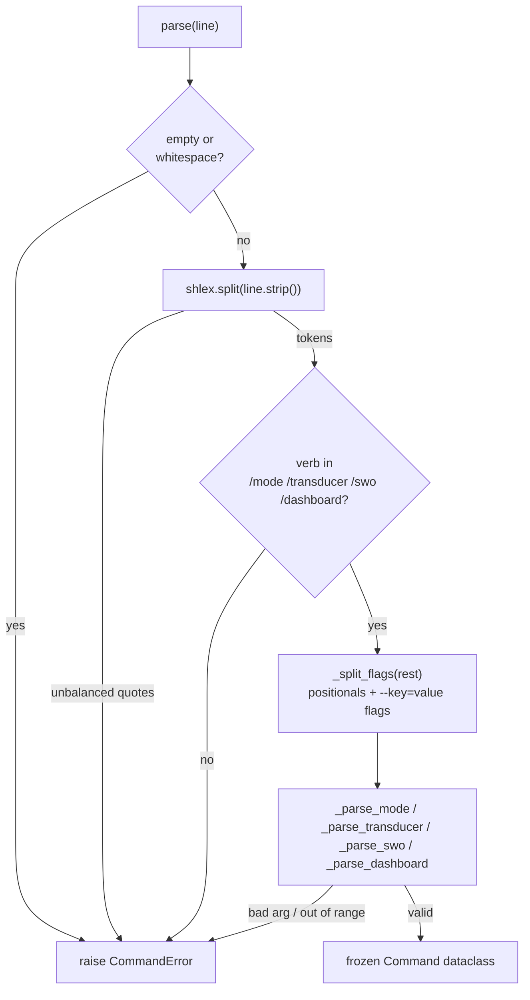

# Command Grammar

A persistent terminal line sits at the base of the SynthOBS interface. At any moment
the operator can bypass the button console and type a command. The grammar is small,
deterministic, and — like everything else in the system — **fails closed**: an unknown
verb or an invalid value raises `CommandError`; the terminal never silently no-ops.

Parser: [`src/synthobs/commands.py`](../src/synthobs/commands.py), entry point `parse(line)`.

## The four verbs

| Verb | Grammar | Typed result |
| --- | --- | --- |
| `/mode` | `--observatory \| --lab \| --ship` | `ModeCommand` |
| `/transducer` | `bind <source> --ratio=<float>` | `BindCommand` |
| `/swo` | `calibrate --flux=<float> --spots=<int> [--target=<id>]` | `CalibrateCommand` |
| `/dashboard` | `plan \| build --name=<scene>` | `DashboardCommand` |

`parse(line)` tokenizes with `shlex`, dispatches on the leading verb, and returns a
typed, frozen `Command` dataclass. Anything else raises `CommandError` (a `ValueError`
subclass). The dispatch pipeline:



### `/mode` → `ModeCommand`

Switches the operator console mode. Accepts a flag or a bare positional.

| Input                            | Result                                              |
| -------------------------------- | --------------------------------------------------- |
| `/mode --observatory`            | `ModeCommand(target=Mode.OBSERVATORY)`              |
| `/mode --lab` / `--laboratory`   | `ModeCommand(target=Mode.LABORATORY)`               |
| `/mode --ship` / `--expedition`  | `ModeCommand(target=Mode.EXPEDITION)`               |
| `/mode observatory`              | same as `--observatory` (bare positional accepted)  |
| `/mode` (no target)              | **`CommandError`**                                  |

### `/transducer bind` → `BindCommand`

Binds an OBS source to the transducer at a given ratio.

| Input                                       | Result                                         |
| ------------------------------------------- | ---------------------------------------------- |
| `/transducer bind cam_01 --ratio=1.618034`  | `BindCommand(source="cam_01", ratio=1.618034)` |
| `/transducer` (no `bind`)                   | **`CommandError`**                             |
| `/transducer bind` (no source)              | **`CommandError`**                             |
| `/transducer bind cam_01` (no `--ratio`)    | **`CommandError`**                             |
| `/transducer bind cam_01 --ratio=abc`       | **`CommandError`** (not a float)               |
| `/transducer bind cam_01 --ratio=-1`        | **`CommandError`** (must be positive)          |
| `/transducer bind cam_01 --ratio=NaN`       | **`CommandError`** (must be finite)            |

### `/swo calibrate` → `CalibrateCommand`

Manually calibrates the oscillator (the same fail-closed rules as live telemetry).

| Input                                                  | Result                                                   |
| ------------------------------------------------------ | -------------------------------------------------------- |
| `/swo calibrate --flux=130 --spots=3 --target=AR4465`  | `CalibrateCommand(flux=130.0, spots=3, target="AR4465")` |
| `/swo calibrate --flux=130 --spots=3`                  | `target=None`                                            |
| `/swo` (no `calibrate`)                                | **`CommandError`**                                       |
| `/swo calibrate --flux=130` (no `--spots`)             | **`CommandError`**                                       |
| `/swo calibrate --flux=-1 --spots=3`                   | **`CommandError`** (flux must be positive)               |
| `/swo calibrate --flux=Infinity --spots=3`             | **`CommandError`** (flux must be finite)                 |
| `/swo calibrate --flux=130 --spots=0`                  | **`CommandError`** (spots must be positive)              |

The finite `--flux>0` and `--spots>0` checks mirror the SWO Hold State exactly — you
cannot hand the grammar a reading the oscillator would itself reject.

### `/dashboard plan|build` → `DashboardCommand`

Creates or previews the deterministic SynthOBS awareness dashboard plan. Both actions
require a non-empty scene name.

| Input                                    | Result                                                   |
| ---------------------------------------- | -------------------------------------------------------- |
| `/dashboard plan --name=Awareness`       | `DashboardCommand(action="plan", name="Awareness")`      |
| `/dashboard build --name=Awareness`      | `DashboardCommand(action="build", name="Awareness")`     |
| `/dashboard`                             | **`CommandError`**                                       |
| `/dashboard inspect --name=Awareness`    | **`CommandError`**                                       |
| `/dashboard plan`                        | **`CommandError`**                                       |

The obspython bridge consumes the parsed command through `dashboard_plan(name)`. Outside
OBS, both actions return deterministic dry-run summaries for tests. Inside OBS, `build`
creates the planned `fractisynth_console` layers and registers next/previous layer
hotkeys.

## Error handling

Every malformed input raises `CommandError`, which carries a human-readable message:

```python
from synthobs.commands import parse, CommandError

try:
    parse("/warp --core")
except CommandError as exc:
    print(exc)   # unknown command verb: '/warp' (known: ['/dashboard', '/mode', '/swo', '/transducer'])
```

Empty or whitespace-only lines, unbalanced quotes, unknown verbs, missing arguments,
non-numeric or non-finite numeric flags, empty dashboard names, and out-of-range values are all
`CommandError`. There is no
input that produces a partial or silent result.

## Inside OBS

The obspython console script (`plugin/synthobs/synthobs_console.py`) exposes
`apply_command(line)`, which runs a line through this exact parser and drives the **real
engine** with the result — returning a status string on success or an `ERROR: …` string
on `CommandError` (never a crash):

{#fig:docs-apply-command width=92%}

`apply_command(line)` consumes the same four typed results shown in the figure.
Successful commands drive the engine and return a status string; `CommandError`
returns `ERROR: ...` without mutating engine state.

See [usage.md](usage.md).
