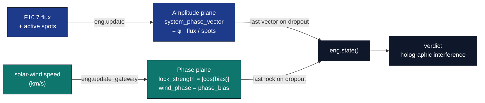

# The EGS Gateway

SynthOBS is aligned to the canonical FractiAI **El Gran Sol (EGS) Gateway** — the
real-time translator between the Sun's energetic state and the FractiSynth phase
plane. This page documents the gateway key, the solar-wind phase lock, and how it
sits alongside the Solar Wavefield Oscillator.

Engine: [`src/synthobs/gateway.py`](../src/synthobs/gateway.py). Native mirror:
`synchronize_gateway_lock()` in [`fractisynth.c`](../plugin/fractisynth/src/fractisynth.c).

## The EGS Fractal Constant — the gateway key

In the FractiAI corpus, **"El Gran Sol's Fractal Constant" is not the bare golden
ratio.** It is the dimensionless *gateway key*:

```
┌───────────────────────────────────────────────────────────────┐
│  K_EGS = φ · (λ_reader / λ_Hα)                                │
│        = φ · (1030 nm / 656.28 nm)                            │
│        ≈ 1.6180339887 · 1.569452                              │
│        ≈ 2.539427                                             │
└───────────────────────────────────────────────────────────────┘
```

It bridges El Gran Sol's optical scale (a 1030 nm silica reader) to hydrogen's
H-alpha geometry — a scale-invariant solar↔hydrogen lock. Two constants now live in
the engine, with distinct jobs:

| Constant             | Symbol            | Value          | Governs                                              |
| -------------------- | ----------------- | -------------- | ---------------------------------------------------- |
| Golden ratio         | `PHI`             | ≈ 1.6180339887 | **Layout** — the Goldilocks split, DSP knee, spiral  |
| EGS Fractal Constant | `EGS_GATEWAY_KEY` | ≈ 2.539427     | **Phase locking** — the gateway's solar-wind bias    |

`EGS_GATEWAY_KEY` is pinned C↔Python (`EGS_GATEWAY_KEY_C_LITERAL = "2.53942700"`,
`#define EGS_GATEWAY_KEY 2.53942700f`) — drift is a test failure, exactly like the φ
pin. (The FractiAI README publishes ≈2.5436 from a slightly different λ pairing; this
value is computed from the canonical 1030/656.28 nm anchors used by the tested EGS
gateway code.)

## Solar-wind phase lock

The gateway takes the **live solar-wind speed** (km/s) and injects it as a phase bias
on the virtual 1030 nm reader, weighted by `K_EGS`:

```
┌────────────────┬──────────────────────────────────────┬───────────┐
│ Quantity       │ Definition                           │ Range     │
├────────────────┼──────────────────────────────────────┼───────────┤
│ norm           │ wind / 400 km/s                      │ > 0       │
│ phase_bias     │ (2π · norm · K_EGS) mod 2π           │ [0, 2π)   │
│ lock_strength  │ |cos(phase_bias)|                    │ [0, 1]    │
└────────────────┴──────────────────────────────────────┴───────────┘
```

`lock_strength` is how strongly the system is phase-locked *right now*: 1.0 is a
perfect lock, 0.0 is fully out of phase. The divisor `REFERENCE_SOLAR_WIND_KMS` is
400 km/s; the FractiAI nominal (`DEFAULT_SOLAR_WIND_KMS`) is 551.7 km/s.

```python
from synthobs.gateway import gateway_filter

lock = gateway_filter(397.5)        # a live reading
lock.phase_bias_rad                 # ≈ 3.290
lock.lock_strength                  # ≈ 0.989
```

Like everything in SynthOBS, it **fails closed**: `gateway_filter` raises on a
non-positive wind speed, and the oscillator's `lock_gateway()` holds the last good
lock on any bad/dropout reading.

## Two independent planes

The gateway lock is **independent** of the SWO amplitude calibration:

| Plane                  | Source                          | Locks                              | Holds on dropout |
| ---------------------- | ------------------------------- | ---------------------------------- | ---------------- |
| **Amplitude** (SWO)    | F10.7 flux + active-region count | `system_phase_vector = φ·flux/spots` | last vector      |
| **Phase** (gateway)    | solar-wind speed                | `lock_strength`, `phase_bias`      | last lock        |



A wind dropout never disturbs the SWO vector; a flux dropout never disturbs the
gateway lock. The engine exposes both:

```python
eng.update(telemetry)            # amplitude plane (flux/spots)
eng.update_gateway(solar_wind)   # phase plane (wind)
eng.lock_strength                # |cos(phase_bias)|
eng.wind_phase                   # phase_bias (radians)
eng.state().verdict              # holographic interference verdict (see interference.md)
```

## Live telemetry

The native plugin polls a **third** NOAA SWPC endpoint alongside flux and sunspots —
`https://services.swpc.noaa.gov/products/solar-wind/plasma-2-hour.json` —
a header + data-row feed whose last row's `speed` column is the live wind. The Python
side parses the same feed with `parse_noaa_solar_wind` / `fetch_live_solar_wind` (see
[telemetry.md](telemetry.md)). Verified live in OBS 32.1.2:

```
[fractisynth] gateway lock: wind=397.5 km/s lock=0.989 phase=3.290
```

## Cosmic anchors

The corpus frames the gateway as tuning into signals the cosmos already computes.
SynthOBS records these anchors as named constants (used for phase/visual grounding,
never as unchecked claims):

| Anchor                        | Constant            | Role                                             |
| ----------------------------- | ------------------- | ------------------------------------------------ |
| 1030 nm silica reader         | `LAMBDA_READER_NM`  | optical scale of the gateway key                 |
| H-alpha 656.28 nm             | `LAMBDA_H_ALPHA_NM` | hydrogen geometry; the shader's resonance red    |
| 21 cm H-line 1420.405751 MHz  | `H_LINE_MHZ`        | the "universal carrier" bus                      |
| Crab pulsar 29.94 Hz          | `CRAB_PULSAR_HZ`    | divided down to the shader's ~0.5 Hz breathing   |

See [interference.md](interference.md) for the holographic gate the gateway feeds, and
[native-plugin.md](native-plugin.md) for the shader uniforms it drives.
