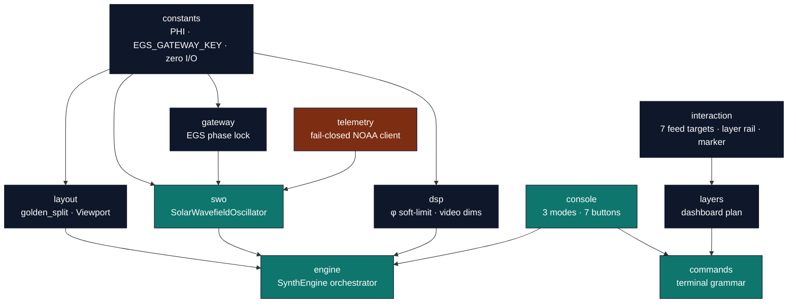
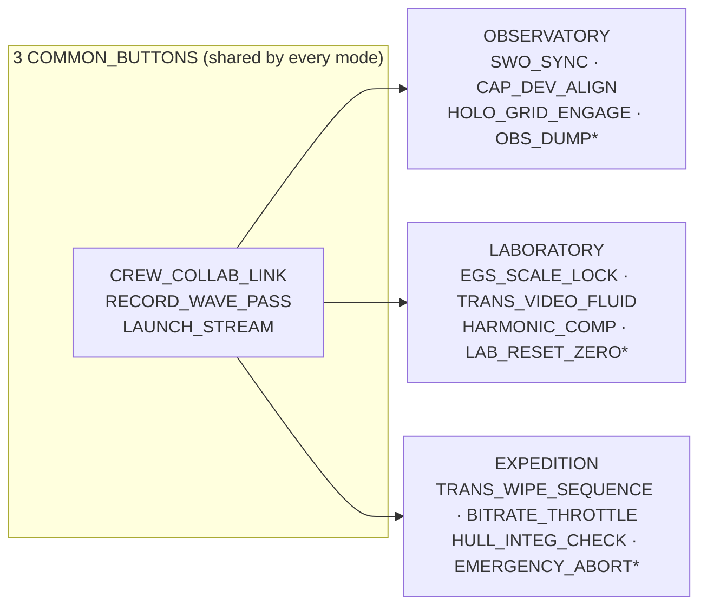
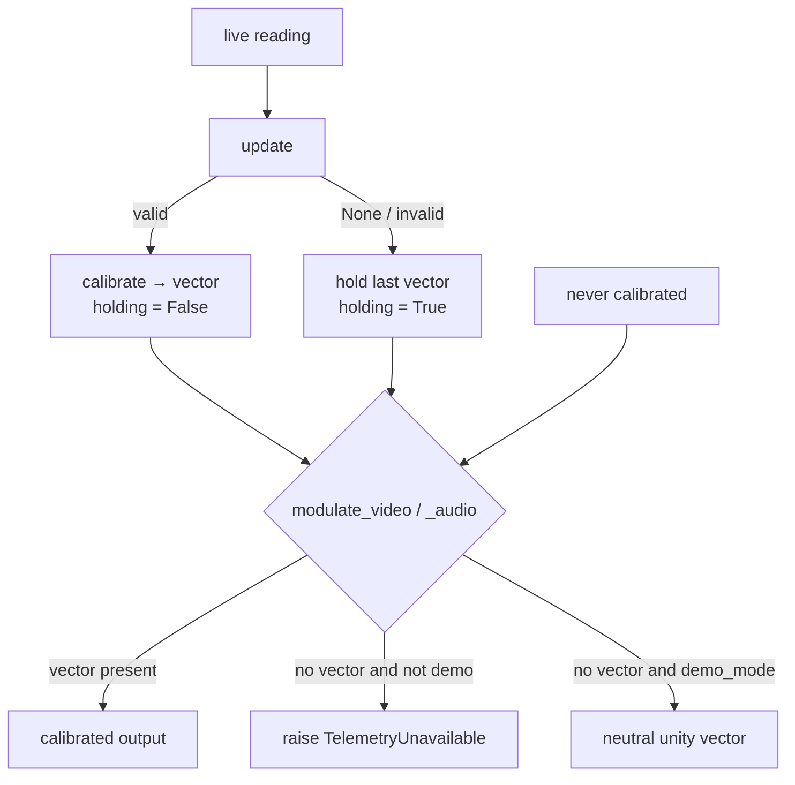

# Python Engine — API Reference

The engine in [`src/synthobs/`](../src/synthobs) is the source of truth. This is a
complete reference for its public surface — every symbol below is present in the source
and exercised by the suite. Most public symbols re-export from the package root:

```python
from synthobs import SynthEngine, Mode, parse, PHI   # etc.
```

The one exception, [`is_monotone_non_decreasing`](#dsp--φ-calibrated-transduction), is a
test helper exported only from the `synthobs.dsp` submodule — it is **not** in the package
root `__all__`. Every other symbol on this page is importable from `synthobs` directly.

## Module map



The cross-module symbols not detailed here — `gateway` (`GatewayLock`,
`egs_fractal_constant`, `gateway_filter`) and `interference` (`NodeField`,
`holographic_gate`, …) — have their own pages: [egs-gateway.md](egs-gateway.md) and
[interference.md](interference.md).

---

## `constants` — the irreducible numeric core

Zero I/O, zero imports from `infrastructure`. See [golden-ratio.md](golden-ratio.md) for
the math.

| Symbol                      | Type    | Value                                                       |
| --------------------------- | ------- | ----------------------------------------------------------- |
| `PHI`                       | `float` | `(1 + √5) / 2` ≈ `1.6180339887498949`                       |
| `EGS_CONSTANT`              | `float` | alias of `PHI`                                              |
| `INV_PHI`                   | `float` | `1/φ` ≈ `0.6180339887498949` (the 61.8 % major fraction)    |
| `INV_PHI_SQ`                | `float` | `1/φ²` ≈ `0.3819660112501051` (the 38.2 % minor fraction)   |
| `PHI_C_LITERAL`             | `str`   | `"1.61803398875"` — the φ literal the C plugin hard-codes   |
| `EGS_GATEWAY_KEY`           | `float` | `φ·(1030/656.28)` ≈ `2.539427` — the solar↔hydrogen lock    |
| `EGS_GATEWAY_KEY_C_LITERAL` | `str`   | `"2.53942700"` — the K_EGS literal the C plugin hard-codes  |
| `LAMBDA_READER_NM`          | `float` | `1030.0` — El Gran Sol silica reader wavelength (nm)        |
| `LAMBDA_H_ALPHA_NM`         | `float` | `656.28` — hydrogen H-alpha rest wavelength (nm)            |
| `REFERENCE_SOLAR_WIND_KMS`  | `float` | `400.0` — baseline that normalizes live wind in the gateway |
| `DEFAULT_SOLAR_WIND_KMS`    | `float` | `551.7` — FractiAI nominal "Seed" wind speed (km/s)         |
| `H_LINE_MHZ`                | `float` | `1420.405751` — neutral-hydrogen 21 cm line (MHz)           |
| `CRAB_PULSAR_HZ`            | `float` | `29.94` — Crab pulsar spin used only as a harmonic ratio    |

> `PHI` governs golden **layout**; `EGS_GATEWAY_KEY` (K_EGS) governs gateway **phase
> locking** to live solar wind. They are distinct constants — do not conflate them.

---

## `layout` — Goldilocks geometry

```python
golden_split(total: int) -> tuple[int, int]
recursive_subdivision(total: int, depth: int) -> list[int]
assemble_viewport(width: int, height: int) -> Viewport
golden_spiral_points(n: int, *, a: float = 1.0, start_theta: float = 0.0) -> list[tuple[float, float]]
```

- **`golden_split(total)`** → `(major, minor)`, integer-exact, `major + minor == total`,
  `major ≈ total · INV_PHI`. Raises `ValueError` on `total < 0`.
- **`recursive_subdivision(total, depth)`** → a list of `depth` sizes summing exactly to
  `total`. Raises `ValueError` on `depth < 1`.
- **`golden_spiral_points(n, *, a, start_theta)`** → `n` points on a logarithmic golden
  spiral (`a` and `start_theta` are keyword-only). Raises `ValueError` on `n < 0`.
- **`assemble_viewport(width, height)`** → a `Viewport`: a `canvas` Region plus three
  decks (`primary` / `console` / `telemetry`) that tile it exactly. Raises `ValueError`
  on a non-positive dimension.

`assemble_viewport` splits the canvas horizontally (primary = major ≈ 61.8 % width), then
splits the right column vertically (console = major height, telemetry = minor):

```text
┌───────────────────────────────┬───────────────┐
│                               │    console    │   right column:
│                               │  (major ≈61.8% │   golden_split(height)
│            primary            │     height)    │
│        (major ≈61.8% width)   ├───────────────┤
│                               │   telemetry   │
│                               │  (minor ≈38.2% │
│                               │     height)    │
└───────────────────────────────┴───────────────┘
 └──── golden_split(width) ─────┘└── deck_w ─────┘
```

### `class Region`

| Member            | Signature               | Notes                          |
| ----------------- | ----------------------- | ------------------------------ |
| construction      | `Region(x, y, width, height)` | a frozen axis-aligned rectangle |
| `area`            | `property -> int`       | `width * height`               |
| `overlaps(other)` | `(Region) -> bool`      | rectangle-intersection test    |

### `class Viewport`

A frozen dataclass: `Viewport(canvas, primary, console, telemetry)` — four `Region`s.

| Member               | Signature                              | Notes                                          |
| -------------------- | -------------------------------------- | ---------------------------------------------- |
| construction         | `Viewport(canvas, primary, console, telemetry)` | four `Region` fields                  |
| `regions()`          | `-> tuple[Region, Region, Region]`     | the three decks (primary, console, telemetry)  |
| `tiles_exactly()`    | `-> bool`                              | `True` — the decks tile the canvas, no gap/overlap |
| `primary_fraction()` | `-> float`                             | the primary deck's area share of the canvas    |

---

## `telemetry` — fail-closed NOAA SWPC client

See [telemetry.md](telemetry.md) for the full fail-closed contract.

```python
parse_noaa_f107_flux(data: Any) -> tuple[float, datetime]
telemetry_from_payload(payload: Any, *, source="payload", max_age_s=DEFAULT_MAX_AGE_S, now=None) -> SolarTelemetry
fetch_live_telemetry(url: str, *, max_age_s=DEFAULT_MAX_AGE_S, timeout=10.0, now=None, opener=None) -> SolarTelemetry
parse_noaa_solar_regions(data: Any) -> int
parse_noaa_solar_wind(data: Any, *, source="payload", max_age_s=DEFAULT_MAX_AGE_S, now=None) -> SolarWind
fetch_live_solar_wind(url=NOAA_SOLAR_WIND_URL, *, max_age_s=DEFAULT_MAX_AGE_S, timeout=10.0, now=None, opener=None) -> SolarWind
parse_noaa_plasma_series(data: Any) -> tuple[list[float], list[float], list[float]]
parse_noaa_xray_flux(data: Any, band="0.1-0.8nm") -> list[float]
parse_noaa_kp_index(data: Any) -> list[float]
```

The module also exposes the solar-wind half of the gateway feed — `SolarWind`,
`parse_noaa_solar_wind`, `fetch_live_solar_wind`, `NOAA_SOLAR_WIND_URL`, and the
`DEFAULT_MAX_AGE_S` staleness bound (3 h). See [egs-gateway.md](egs-gateway.md).
The three series parsers feed the native Solar Graph mirror: plasma density/speed/
temperature, GOES X-ray flux, and estimated Kp.

### `class TelemetryUnavailable(RuntimeError)`

Raised on a non-200 response, malformed payload, `flux ≤ 0`, `sunspots ≤ 0`, missing/
malformed timestamp, or stale/future data. The client **never** substitutes an average
or a default.

### `class SolarTelemetry`

Immutable snapshot of one verified live reading.

| Member                  | Signature                                              | Notes                                  |
| ----------------------- | ------------------------------------------------------ | -------------------------------------- |
| construction            | `SolarTelemetry(flux, sunspots, source, observed_at, regions=())` | `source` is required; `regions` defaults to `()` |
| `flux`                  | `float`                                                | current F10.7 flux (solar flux units)  |
| `sunspots`              | `int`                                                  | active sunspot-region count            |
| `source`                | `str`                                                  | provenance (URL or `'override'`)       |
| `observed_at`           | `datetime`                                             | UTC observation timestamp              |
| `regions`               | `tuple[str, ...]`                                      | active region designators, e.g. `('AR4465',)` |
| `age_seconds(now)`      | `(datetime) -> float`                                  | staleness in seconds relative to `now` |

- **`parse_noaa_f107_flux(data)`** → `(flux, observed_at)`, raising `TelemetryUnavailable`
  on a malformed F10.7 payload.
- **`telemetry_from_payload(payload, …)`** → a `SolarTelemetry` built from a raw NOAA JSON
  dict, validating every field and the staleness window.
- **`fetch_live_telemetry(url, …)`** → performs the live HTTP fetch and returns a
  validated `SolarTelemetry`. (Tested with `pytest-httpserver` against local servers — no
  mocks.) The `opener` keyword is injectable only to point tests at a local server.
- **`parse_noaa_solar_regions(data)`** → active-region count for the latest observed
  date in NOAA `solar_regions.json`.
- **`parse_noaa_plasma_series(data)`**, **`parse_noaa_xray_flux(data, band)`**, and
  **`parse_noaa_kp_index(data)`** → real-time graph series; malformed or fully invalid
  feeds raise `TelemetryUnavailable`.

---

## `swo` — the Solar Wavefield Oscillator

```python
phase_vector(flux: float, spots: int) -> float
```

The pure phase kernel: `(flux / spots) · φ`. The caller must guarantee `flux > 0` and
`spots > 0`.

### `class SolarWavefieldOscillator`

A stateful dataclass with two independent fail-closed planes — the **amplitude** plane
(flux/spots → `system_phase_vector`) and the **EGS gateway** phase plane (solar wind →
lock). Either can hold while the other re-locks.

| Member                            | Signature                  | Notes                                                                                       |
| --------------------------------- | -------------------------- | ------------------------------------------------------------------------------------------- |
| `calibrate(current_flux, active_spots)` | `(float, int) -> bool` | Commits a new phase vector and returns `True` on valid input; on non-finite `flux`, `flux ≤ 0`, or `spots ≤ 0` it **holds** the last verified vector and returns `False`. Never raises. |
| `hold_vector()`                   | `-> float \| None`         | The last verified phase vector, or `None` if never calibrated.                              |
| `lock_gateway(solar_wind_kms)`    | `(float) -> bool`          | Locks the gateway phase plane from a live wind reading; returns `False` and holds on a non-positive/non-finite reading. |
| `lock_strength`                   | `property -> float`        | Gateway lock strength `\|cos(phase_bias)\|` ∈ `[0,1]`; `0.0` if never locked.                |
| `wind_phase`                      | `property -> float`        | Gateway phase bias (radians); `0.0` if never locked.                                        |

This is the **Hold State**: a bad reading can never overwrite a good calibration.

---

## `dsp` — φ-calibrated transduction

```python
video_calibrated_dims(width: int, height: int) -> tuple[int, int]
spatial_scale_matrix(factor: float = PHI) -> list[list[float]]
phi_soft_limit_sample(x: float, threshold: float) -> float
phi_soft_limit(samples: Iterable[float], threshold: float = 1.0) -> list[float]
audio_envelope(samples: Iterable[float], threshold: float = 1.0) -> AudioEnvelope
```

- **`video_calibrated_dims(w, h)`** → a φ-scaled bounding box `(round(w/φ), round(h/φ))`;
  each dim is clamped to `≥ 1` for inputs `≥ 1`. Raises `ValueError` on a negative dim.
- **`spatial_scale_matrix(factor)`** → a 3×3 homogeneous matrix that scales by `1/factor`
  (diagonal = `1/factor`). Raises `ValueError` on a non-finite or zero factor.
- **`phi_soft_limit_sample(x, threshold)`** → one limited sample; knee at `threshold·(1/φ)`,
  `|out| ≤ threshold` for all `x` (incl. `±inf`, `nan`). Raises `ValueError` on
  a non-finite or non-positive threshold.
- **`phi_soft_limit(samples, threshold)`** → the limiter applied across a signal.
- **`audio_envelope(samples, threshold)`** → post-limiter `AudioEnvelope(rms, peak,
  reactivity, sample_count)`; `reactivity` is φ-scaled and clamped to `[0, 1]`.

> **`is_monotone_non_decreasing(values)`** — a transfer-curve monotonicity check used by
> the test suite. It lives in `synthobs.dsp` but is **not** re-exported at the package
> root; import it as `from synthobs.dsp import is_monotone_non_decreasing`.

---

## `console` — operator modes and the button grid

```python
class Mode(str, Enum):   # OBSERVATORY, LABORATORY, EXPEDITION
class Button:            # a frozen, id'd console control
class Console: ...
COMMON_BUTTONS           # the 3 shared buttons (module-level tuple)
```



`*` marks the per-mode safety button (`is_safety=True`). Each mode shows **3 common + 4
unique = 7** buttons.

### `class Button`

Frozen dataclass: `Button(id, label, kind, description, is_safety=False)` where `kind` is
`"common"` or `"unique"`.

### `class Console`

| Member                  | Signature                          | Notes                                                  |
| ----------------------- | ---------------------------------- | ------------------------------------------------------ |
| `modes()`               | `-> tuple[Mode, ...]`              | the three modes                                        |
| `common_buttons()`      | `-> tuple[Button, ...]`            | the 3 buttons shared by every mode                     |
| `unique_buttons(mode)`  | `(Mode) -> tuple[Button, ...]`     | the 4 buttons unique to a mode                         |
| `buttons(mode)`         | `(Mode) -> tuple[Button, ...]`     | common + unique = 7 per mode                           |
| `button_ids(mode)`      | `(Mode) -> tuple[str, ...]`        | the 7 ids for a mode                                   |
| `all_button_ids()`      | `-> list[str]`                     | all 21 ids (3 modes × 7, common ids repeated)          |
| `distinct_button_ids()` | `-> set[str]`                      | the 15 distinct ids (3 common + 12 unique)             |
| `safety_button(mode)`   | `(Mode) -> Button`                 | the `is_safety` control for the mode; raises if missing |
| `validate()`            | `-> None`                          | raises if the 3-common / 4-unique / disjoint invariants break |

**Invariant:** 3 modes × 7 buttons = 21 total; 3 common ids are identical across modes;
the 4 unique ids per mode are disjoint; 15 distinct ids overall.

---

## `commands` — the terminal grammar

See [command-grammar.md](command-grammar.md) for syntax and examples.

```python
parse(line: str) -> Command
```

| Type                      | Fields                                                   |
| ------------------------- | -------------------------------------------------------- |
| `Command` (base)          | `raw: str`                                               |
| `ModeCommand`             | `raw`, `target: Mode = Mode.OBSERVATORY`                 |
| `BindCommand`             | `raw`, `source: str = ""`, `ratio: float = 0.0`          |
| `CalibrateCommand`        | `raw`, `flux: float = 0.0`, `spots: int = 0`, `target: str \| None = None` |
| `DashboardCommand`        | `raw`, `action: str = "plan" \| "build"`, `name: str = ""` |
| `CommandError(ValueError)`| raised on empty line, unknown verb, or invalid/out-of-range args |

---

## `interaction` — clickable target geometry

```python
class Feed(IntEnum):        # WAVEFIELD..SOLAR_GRAPH, values 0..6
class GraphMetric(IntEnum): # WIND_SPEED, WIND_DENSITY, WIND_TEMPERATURE, XRAY_FLUX, KP_INDEX
class TargetAction(str, Enum): # NONE, FEED, LAYER_TOGGLE, MARKER
resolve_target_action(x, y, width, height, *, button="left", show_targets=True, layer_count=0) -> TargetHit
```

The geometry mirrors the native `fractisynth_console` source exactly: the top 9% of the
canvas is seven feed cells; the left 7% below that strip is a layer-toggle rail; the
remaining canvas drops a normalized marker. Invalid coordinates, non-left buttons,
hidden targets, or non-positive canvas dimensions return `TargetAction.NONE`.

| Type | Fields |
| --- | --- |
| `TargetHit` | `action: TargetAction`, `feed: Feed \| None`, `layer_index: int \| None`, `marker: tuple[float, float] \| None` |

---

## `layers` — deterministic dashboard planning

```python
dashboard_plan(scene_name: str) -> DashboardPlan
```

`dashboard_plan` returns a seven-layer OBS scene plan with normalized bounds:
Wavefield, Telemetry HUD, and Solar Graph layers for wind speed, wind density, wind
temperature, GOES X-ray flux, and Kp index. It raises `ValueError` for an empty scene
name, so the command grammar and obspython bridge fail closed before touching OBS state.

| Type | Fields |
| --- | --- |
| `DashboardLayer` | `name`, `feed: Feed`, `graph_metric: GraphMetric \| None`, `bounds: tuple[float, float, float, float]`, `visible: bool` |
| `DashboardPlan` | `scene_name: str`, `layers: tuple[DashboardLayer, ...]` |

---

## `history` — bounded waveform state

```python
Sample(flux, solar_wind_kms, lock_strength, phase_bias_rad)
TelemetryHistory(capacity=128)
```

`Sample` rejects non-real and non-finite values. `TelemetryHistory` mirrors the C HUD
ring buffer: it stores the most recent samples in chronological order, evicts the oldest
sample past capacity, returns raw field series, normalized series, and the latest
sample, and raises `ValueError` on invalid field names or invalid normalization bounds.

## `provenance` — byte-exact HUD signature payloads

```python
TelemetryRecord(flux, sunspots, solar_wind_kms, lock_strength, phase_bias_rad, observed_unix)
canonical_bytes(record) -> bytes
provenance_digest(record) -> str
short_signature(record) -> str
signature_bits(signature) -> tuple[int, ...]
build_payload(record) -> bytes
embed_lsb(rgba, width, height, payload) -> None
extract_lsb(rgba, width, height) -> bytes
verify_payload(payload) -> TelemetryRecord
```

`TelemetryRecord` is the locked-overlay provenance record. It requires finite values,
positive flux, positive solar-wind speed, `sunspots` in signed-int32 range,
`lock_strength` in `[0, 1]`, and `observed_unix` in uint32 range. The wire format is a
fixed 24-byte little-endian record plus a 4-byte truncated SHA-256 checksum. LSB embed
and extract functions raise `ProvenanceError` on malformed buffers, undersized frames,
oversized payloads, checksum mismatch, or invalid recovered records.

`signature_bits` converts the 8-hex on-screen signature into the 32-bit visible-strip
contract mirrored by the native HUD. It is a fallback signal for captures where OBS
resampling destroys the row-0 blue LSBs.

## `verification` — live-gate scoring contracts

```python
AUDIO_METER_TOP_FRACTION = 0.955   # shader meter band: uv.y > 0.955
audio_meter_roi(width, height) -> tuple[int, int, int, int]
score_roi_delta(before, after, width, height, *, channels=4, roi, threshold) -> RoiDelta
score_audio_meter_delta(before, after, width, height, *, channels=4, threshold=8.0) -> RoiDelta
GateResult.passed(reason, **metrics) -> GateResult
GateResult.failed(reason, **metrics) -> GateResult
GateResult.skipped(reason, **metrics) -> GateResult
```

The live OBS harness stays in `scripts/`; this module owns only deterministic scoring.
`audio_meter_roi` pins the shader's bottom meter band (`AUDIO_METER_TOP_FRACTION`,
`uv.y > 0.955`); `score_roi_delta` returns the mean/max absolute RGB delta inside any
ROI as a frozen `RoiDelta` (alpha ignored, invalid dims/ROIs/thresholds raise rather
than soft-pass), and `score_audio_meter_delta` is the thin wrapper that scores a
silent-vs-tone pair in the meter ROI. `GateResult` serializes manifest gates as explicit
`pass`, `fail`, or `skip` records with scalar metrics.

---

## `engine` — the orchestrator

### `class EngineState`

A snapshot dataclass of the engine's calibration health (amplitude + gateway planes).

| Field           | Type                          | Notes                                            |
| --------------- | ----------------------------- | ------------------------------------------------ |
| `mode`          | `Mode`                        | current operator mode                            |
| `is_calibrated` | `bool`                        | amplitude plane has a verified vector            |
| `phase_vector`  | `float \| None`               | the live/held vector, or `None` pre-calibration  |
| `holding`       | `bool`                        | `True` when running on a held (stale) vector     |
| `last_source`   | `str \| None`                 | provenance of the last good calibration          |
| `lock_strength` | `float = 0.0`                 | EGS gateway lock `\|cos(phase_bias)\|` ∈ `[0,1]`  |
| `wind_phase`    | `float = 0.0`                 | gateway phase bias (radians)                     |
| `verdict`       | `InterferenceVerdict \| None` | holographic interference outcome, or `None`      |

### `class SynthEngine`

Constructed as `SynthEngine(*, mode=Mode.OBSERVATORY, demo_mode=False)`.

| Member                                | Signature                                  | Notes                                                              |
| ------------------------------------- | ------------------------------------------ | ----------------------------------------------------------------- |
| `mode`                                | `property -> Mode`                         | current operator mode                                             |
| `switch_mode(mode)`                   | `(Mode) -> Mode`                           | change mode, returns the new mode                                 |
| `console`                             | `property -> Console`                      | the button console                                               |
| `update(telemetry)`                   | `(SolarTelemetry \| None) -> bool`         | calibrate from a reading; `None` ⇒ **hold** (returns `False`)     |
| `update_from_fetch(fetch)`            | `(callable) -> bool`                       | call a zero-arg fetcher, catching `TelemetryUnavailable` into hold |
| `update_gateway(wind)`                | `(SolarWind \| None) -> bool`              | lock the EGS gateway phase plane; `None` ⇒ hold                   |
| `lock_strength`                       | `property -> float`                        | gateway lock strength ∈ `[0,1]`; `0.0` if unlocked                |
| `wind_phase`                          | `property -> float`                        | gateway phase bias (radians)                                     |
| `holographic_verdict()`              | `-> InterferenceVerdict \| None`           | resolve the holographic gate; `None` until the gateway has locked |
| `phase_vector`                        | `property -> float \| None`                | current vector, or `None` pre-calibration                        |
| `state()`                             | `-> EngineState`                           | full snapshot (a method, not a property)                         |
| `layout(width, height)`               | `(int, int) -> Viewport`                   | the φ viewport for a frame                                       |
| `modulate_video(width, height)`       | `(int, int) -> tuple[int, int]`            | calibrated dims; **raises before first calibration** unless demo  |
| `modulate_audio(samples, threshold=1.0)` | `(Iterable, float) -> list[float]`      | φ soft-limited signal; same pre-calibration guard                |
| `measure_audio(samples, threshold=1.0)` | `(Iterable, float) -> AudioEnvelope`    | post-limiter RMS/peak/reactivity; same pre-calibration guard     |

**The pre-calibration guard is the engine's fail-closed core:** `modulate_video` and
`modulate_audio` / `measure_audio` raise `TelemetryUnavailable` if the engine has never
successfully calibrated — unless it was constructed in `demo_mode` (which returns a
neutral unity vector). There is no path to "modulate with a guessed vector".



---

## Worked example

```python
from synthobs import SynthEngine, SolarTelemetry, Mode
from datetime import datetime, timezone

engine = SynthEngine()
engine.switch_mode(Mode.OBSERVATORY)

# Before calibration, modulation is refused:
try:
    engine.modulate_video(1920, 1080)
except Exception as exc:
    print("refused pre-calibration:", exc)

# Calibrate from a reading, then modulate (`source` is a required field):
reading = SolarTelemetry(
    flux=142.0,
    sunspots=601,
    source="override",
    observed_at=datetime.now(timezone.utc),
)
engine.update(reading)                      # True
print(engine.phase_vector)                  # (142.0 / 601) · φ
print(engine.modulate_video(1920, 1080))    # calibrated (w, h)

# A bad subsequent reading holds the last good vector:
engine.update(None)                         # False — Hold State
```
