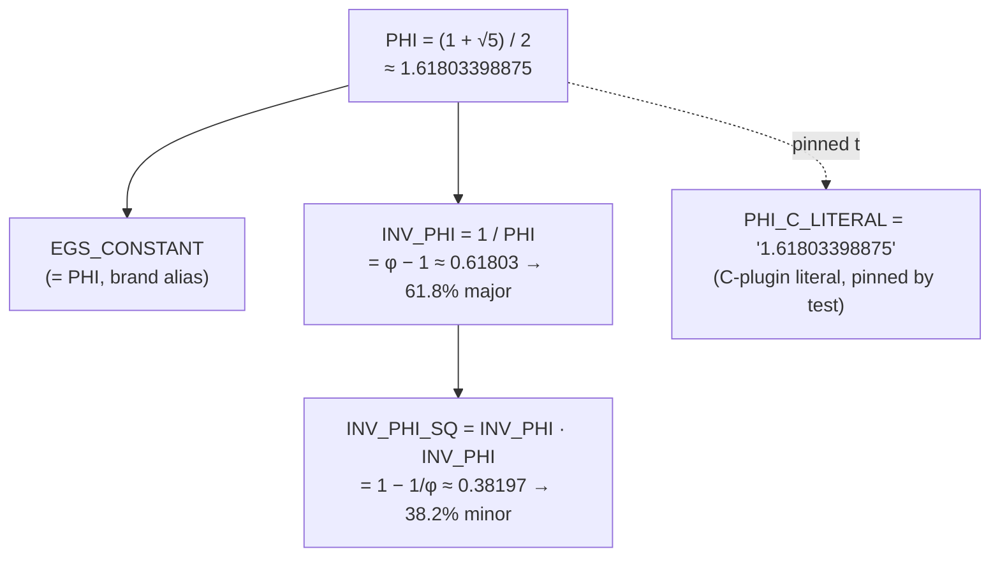

# The Golden-Ratio Mathematics

Everything in SynthOBS scales against one constant. This page documents the constant,
its derived ratios, and the three places they shape the system: spatial layout, the
audio soft limiter, and the spatial scale matrix.

## The constant and its family

Defined once in [`src/synthobs/constants.py`](../src/synthobs/constants.py):

| Symbol          | Definition       | Value                  | Meaning                                            |
| --------------- | ---------------- | ---------------------- | -------------------------------------------------- |
| `PHI`           | `(1 + √5) / 2`   | ≈ 1.6180339887498949   | φ — the golden ratio / EGS fractal constant        |
| `EGS_CONSTANT`  | `= PHI`          | ≈ 1.6180339887498949   | Brand-canonical alias, identical to `PHI`          |
| `INV_PHI`       | `1 / PHI`        | ≈ 0.6180339887498949   | 1/φ = φ − 1 — the **61.8 %** "major" fraction       |
| `INV_PHI_SQ`    | `INV_PHI * INV_PHI` | ≈ 0.3819660112501051 | 1/φ² = 1 − 1/φ — the **38.2 %** "minor" fraction     |
| `PHI_C_LITERAL` | `"1.61803398875"` | (string)              | The decimal the C plugin hard-codes; pinned to `PHI` by test |

How the family derives from a single definition site:



Two identities the code relies on:

- **φ − 1 = 1/φ** — so the "major" fraction of a split equals `INV_PHI`.
- **1/φ + 1/φ² = 1** — so a major (61.8 %) plus minor (38.2 %) tiles the whole exactly.

> **φ vs the EGS Fractal Constant.** `EGS_CONSTANT` is a brand alias for φ used in
> *layout*. It is **not** the same as the canonical FractiAI **EGS Fractal Constant**
> (the "gateway key" `K_EGS = φ·λ_reader/λ_Hα ≈ 2.539427`), which governs solar-wind
> *phase locking*. Two different constants, two different jobs — see
> [egs-gateway.md](egs-gateway.md).

## 1. The Goldilocks split (`layout.golden_split`)

```python
golden_split(total: int) -> tuple[int, int]   # (major, minor), major + minor == total
```

`golden_split` cuts an integer length into a 61.8 / 38.2 pair. It is **integer-exact**:
the two parts always sum back to `total` with no rounding gap — the major part is
`round(total · INV_PHI)` and the minor is the exact remainder. This is what lets a
viewport tile without a one-pixel seam.

```
golden_split(total)
                   │◄──────────────── total ─────────────────►│
                   ┌───────────────────────────┬──────────────┐
                   │  major = round(total·1/φ)  │    minor     │
                   │       ≈ 61.8 %             │  ≈ 38.2 %    │
                   └───────────────────────────┴──────────────┘
                    major + minor == total   (exact, no seam)
```

> **Invariant subtlety (documented gotcha).** Successive `REGION` sizes shrink by
> **1/φ² per region**, *not* 1/φ. The true per-cut invariant is `major / remaining =
> 1/φ`; because each cut consumes the major share, consecutive *region* areas fall by
> 1/φ². If you assert "each region is 1/φ of the previous", the test fails — assert the
> per-cut major/remaining ratio instead.

### Recursive subdivision and the spiral

```python
recursive_subdivision(total: int, depth: int) -> list[int]
golden_spiral_points(n: int, *, a: float = 1.0, start_theta: float = 0.0) -> list[tuple[float, float]]
assemble_viewport(width: int, height: int) -> Viewport
```

- `recursive_subdivision` applies the golden split `depth` times, returning the chain
  of sizes — the basis of nested φ panels. Each cut keeps the major share and re-splits
  the remainder:

  ```
  recursive_subdivision(total, depth=4)
      ┌──────────────┬────────┬────┬───┐
      │   major₀     │ major₁ │ m₂ │m₃ │   sizes = [major₀, major₁, major₂, minor₃]
      └──────────────┴────────┴────┴───┘   Σ sizes == total   (exact, ISC-5)
        ◄ 1/φ ►        ◄1/φ►            consecutive cuts → ratio 1/φ (ISC-6)
  ```

- `golden_spiral_points` samples a logarithmic golden spiral (growth factor φ per
  quarter-turn) — the geometric signature used in the figures.
- `assemble_viewport` returns a `Viewport` dataclass holding four `Region`s
  (`canvas`, `primary`, `console`, `telemetry`); `regions()` exposes the three decks
  that partition the canvas. The canvas is split horizontally into a primary deck (major
  ≈61.8 % width) and a right column, which is then split vertically into the console deck
  (major ≈61.8 % height) and telemetry strip (minor ≈38.2 %). `tiles_exactly()` is `True`
  and `primary_fraction()` returns `primary.area / canvas.area`:

  ```
  assemble_viewport(width, height)
      ┌──────────────────────────────┬───────────────────┐
      │                              │   console deck     │  ◄ major
      │                              │  (≈61.8% height)   │    ≈61.8%
      │      primary output deck     ├───────────────────┤    height
      │       (≈61.8% width)         │  telemetry strip   │  ◄ minor
      │                              │  (≈38.2% height)   │    ≈38.2%
      └──────────────────────────────┴───────────────────┘
        ◄──── major ≈61.8% width ────►◄── minor ≈38.2% ──►
        tiles_exactly() == True   (no overlap, no gap)
  ```

## 2. The audio soft limiter (`dsp.phi_soft_limit`)

```python
phi_soft_limit_sample(x: float, threshold: float) -> float
phi_soft_limit(samples: Iterable[float], threshold: float = 1.0) -> list[float]
audio_envelope(samples: Iterable[float], threshold: float = 1.0) -> AudioEnvelope
```

A `tanh`-based soft limiter whose **knee sits at `1/φ`** of the threshold (`knee =
threshold · INV_PHI`). Below the knee the response is the identity (transparent); above
it the excess is compressed by `headroom · tanh(excess / (headroom·φ))` — where
`headroom = threshold − knee == threshold · 1/φ²` — so the magnitude approaches but
**never hard-clips** the ceiling.

```
 |out|
threshold ┤ - - - - - - - - - - - - - · · · · ·   ← ceiling, asymptote (never reached)
          │                      · ·
          │                 · ·          ┌──────────────────────────────┐
          │              ·               │ above knee: tanh compression  │
   knee = ┤ - - - - - · ╮                │ excess = |x| − knee           │
   thr/φ  │        ·    │                │ out = knee + headroom·tanh(…) │
          │     ·       │ identity       └──────────────────────────────┘
          │  ·          │ (out = x)
        0 ┼·────────────┴──────────────────────────────►  |x|
          0           knee=1/φ
```

Properties the suite verifies (ISC-27..31):

| Property                  | Guarantee                                                         |
| ------------------------- | ---------------------------------------------------------------- |
| Bounded                   | `|out| ≤ threshold` for **every** input, incl. `±1e9`, `±inf`, `nan` |
| NaN/Inf-safe              | non-finite inputs clamp into the ceiling (`nan → 0`), never garbage |
| Identity below knee       | `out = x` for `|x| ≤ knee = threshold · 1/φ`                      |
| Monotone non-decreasing   | transfer curve checked by `is_monotone_non_decreasing`           |

This is the same knee the C plugin's `phi_soft_limit_sample`
([`plugin/fractisynth/src/fractisynth.c`](../plugin/fractisynth/src/fractisynth.c))
implements for OBS audio.

`threshold` itself must be finite and positive; `NaN`, `±Inf`, zero, and negative
thresholds raise `ValueError` before a transfer curve is computed.

`audio_envelope` measures the **post-limiter** buffer, not the raw input. It returns
`AudioEnvelope(rms, peak, reactivity, sample_count)`, where `peak <= threshold` and
`reactivity = clamp((rms / threshold) · φ, 0, 1)`. The native audio filter mirrors this
envelope and publishes the values to the console shader (`audio_rms`, `audio_peak`,
`audio_reactivity`), the Telemetry HUD, and the Qt dock.

## 3. The spatial scale matrix (`dsp.spatial_scale_matrix`)

```python
video_calibrated_dims(width: int, height: int) -> tuple[int, int]
spatial_scale_matrix(factor: float = PHI) -> list[list[float]]
```

- `video_calibrated_dims` returns the bounding box scaled **down** by φ — i.e.
  `(round(w·1/φ), round(h·1/φ))`, the "calibrated harmonic bounds" a frame is composed
  within (clamped to ≥1 per axis for `w,h ≥ 1`; ISC-26).
- `spatial_scale_matrix(factor=φ)` returns a 3×3 homogeneous matrix that scales by
  `1/factor`. At the default `factor = φ` the two spatial diagonal entries are each
  `1/φ` (the suite asserts `m[0][0] == m[1][1] ≈ INV_PHI`); the homogeneous entry
  `m[2][2]` stays `1.0`. A non-finite or zero `factor` raises `ValueError` (ISC-32):

  ```
  spatial_scale_matrix(φ)
      ┌                      ┐
      │ 1/φ    0      0      │   m[0][0] = 1/φ  (x scale)
      │  0    1/φ     0      │   m[1][1] = 1/φ  (y scale)
      │  0     0     1.0     │   m[2][2] = 1.0  (homogeneous)
      └                      ┘
  ```

## Why integer-exactness matters

Pixels are integers. A layout law that "approximately" splits 61.8 / 38.2 accumulates
rounding error across nested panels until seams appear. SynthOBS instead computes the
major share and takes the exact remainder, so `major + minor == total` holds at every
depth. The golden ratio is the *only* split where the major-to-remainder and
remainder-to-whole ratios are equal — which is precisely why the recursion is
self-similar at every scale. That self-similarity is the "fractal" in FractiSynth.
