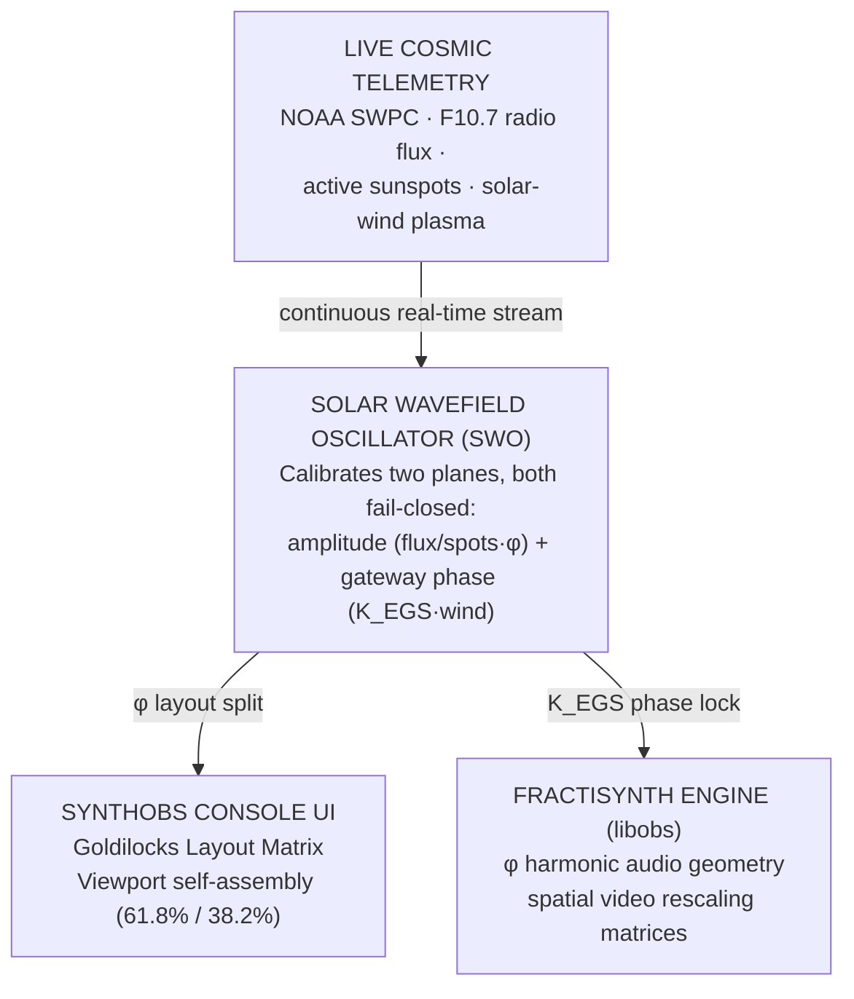

# Executive Primer {#sec:intro}

## The Intention

OBS Studio already provides a modular host for scenes, sources, filters, and
operator control. The engineering problem addressed here is narrower: how to keep
those surfaces composable when layout, telemetry admission, signal shaping, and
live evidence are implemented across Python, native C, and the OBS runtime. A
useful design therefore needs explicit contracts at each boundary rather than
implicit coordination through UI state.

This project names that design language **Omniversal Observatory, Laboratory, and
Expedition Ship**. The names describe three operator modes; they are not claims
about the physical origin of the signal or about perceptual superiority. The
implementation supplies a recursive viewport allocator, a fail-closed telemetry
adapter, native OBS filters, and a reproducible evidence bundle so each boundary
can be inspected independently.

## The Solution

The solution is a decoupled, dual-layer infrastructure comprising SynthOBS and
FractiSynth, bound natively to **v1.618 — the Goldilocks Calibration Standard**. The
host boundary follows OBS's documented module model [@obsmodules], and the live
control path is exercised through obs-websocket's documented protocol surface
[@obswebsocket]:

- **SynthOBS (The Vessel Console):** an intelligent UI wrapper that abstracts
  standard OBS operations, using a dynamic, recursive viewport allocation algorithm
  to auto-assemble layout structures based on perfect geometric harmony.
- **FractiSynth (The Transducer Core Engine):** a native, real-time signal
  processing plugin that sits directly within the core rendering and audio mixing
  loops of the broadcast pipeline (`libobs`).

<!-- alt: System boundary diagram showing live NOAA telemetry entering the fail-closed SWO, which supplies the golden-ratio console layout and EGS phase lock to the native FractiSynth engine. -->

The centralized SWO maintains two independent fail-closed planes. The **amplitude
plane** computes the tested flux-to-spots vector using $\varphi$; the **gateway
phase plane** computes a bounded phase bias from solar-wind speed and
$K_{\mathrm{EGS}}$. The Python engine uses the verified vector to gate modulation,
while native OBS paths consume the corresponding adapter state. If telemetry is
non-finite, stale, or outside its admitted range, the affected plane holds its last
verified state.

## Core Foundational Theory

**The golden layout constant.** The implementation pins the golden ratio as a
numerical design constant for layout and DSP contracts:

$$
\varphi = \frac{1 + \sqrt{5}}{2} \approx 1.61803398875
$$ {#eq:phi-golden-ratio}

In this framework, $\varphi$ from @eq:phi-golden-ratio determines the tested
viewport split, recursive subdivisions, deterministic spiral, and soft-limiter
parameters. The major and minor fractions are $1/\varphi \approx 0.618$ and
$1/\varphi^2 \approx 0.382$. These are explicit engineering choices; the project
does not infer a perceptual or universal-design result from them.

**The EGS gateway key.** Crucially, El Gran Sol's *Fractal Constant* is not the bare
golden ratio. It is the dimensionless gateway key $K_{\mathrm{EGS}}$ that bridges El
Gran Sol's optical reader scale ($\lambda_{\text{reader}} = 1030\,\text{nm}$) to
hydrogen's H-alpha geometry ($\lambda_{\text{H-alpha}} = 656.28\,\text{nm}$):

$$
K_{\mathrm{EGS}} = \varphi \cdot \frac{\lambda_{\text{reader}}}{\lambda_{\text{H-alpha}}} \approx 2.539427
$$ {#eq:intro-egs-gateway-key}

Where $\varphi$ governs *layout and DSP*, $K_{\mathrm{EGS}}$ from
@eq:intro-egs-gateway-key supplies the dimensionless phase calculation used by the
gateway adapter. It is a project-specific design key, not a physical measurement
of a solar-to-hydrogen coupling.

**The Calibrated Wavefield Concept.** Software environments can drift when
interface, media, and processing modules carry inconsistent state. The SWO makes
the relevant state explicit on two independent planes. The amplitude plane emits
the *system phase vector* from F10.7 radio flux and active-region count:

$$
v_{\text{phase}} = \frac{\Phi_{10.7}}{N_{\text{spots}}} \cdot \varphi
$$ {#eq:system-phase-vector}

The gateway plane maps the admitted solar-wind speed to a phase bias and resolves a
lock strength with the tested interference function:

$$
\theta = \left(2\pi \cdot \frac{w}{w_{\text{ref}}} \cdot K_{\mathrm{EGS}}\right) \bmod 2\pi,
\qquad
\ell = \lvert \cos\theta \rvert
$$ {#eq:gateway-lock-strength}

In @eq:gateway-lock-strength the lock strength $\ell \in [0, 1]$ is a deterministic
function of the admitted wind value. The gateway returns a named interference
verdict—constructive, destructive, or mixed—rather than a bare boolean. These
verdicts are control states in the application model, not observations of physical
coherence. Invalid flux, spots, or wind values are rejected independently; the
affected plane holds its last verified state rather than emitting a replacement.

## Scholarly positioning

This is a design-and-reproducibility paper, not a claim that the golden ratio is a
universal law of perception or broadcast quality. The manuscript makes explicit
engineering propositions: a single pinned constant reduces cross-language drift; a
fail-closed telemetry boundary prevents invalid readings from becoming control
state; and a versioned evidence bundle makes a live OBS demonstration inspectable.
Those propositions are situated in established software-practice guidance on
reproducible computational work [@wilson2014; @sandve2013] and in the National
Academies distinction between reproducibility and replicability [@nasem2019]. The
visionary FractiSynth register remains the system's design language; the evaluation
chapter below states which parts are source-backed, test-backed, or live-capture-backed.

## Research-software contribution

The scholarly object is not only the prose description of an interface. It is the
coupled source tree, executable tests, build metadata, evidence bundle, and rendered
manuscript. This matters because a result produced by a hybrid instrument can be
misdescribed in at least three ways: a citation may establish the meaning of an
external product but not the behavior of the adapter; a unit test may establish a
parser contract but not prove that an installed OBS binary rendered it; and a
screenshot may show a compelling state without identifying the exact software and
inputs that produced it. SynthOBS therefore makes the chain explicit and keeps each
claim attached to the evidence class that can actually falsify it.

This treatment follows the software-citation principles of importance, credit,
unique identification, persistence, accessibility, and specificity
[@smith2016softwarecitation]. The planned public home is
[`docxology/SynthOBS`](https://github.com/docxology/SynthOBS); the current candidate
also carries `CITATION.cff` metadata conforming to the Citation File Format schema
[@cffschema]. A repository URL is the active project identity. The eventual public
tag, commit, and archival identifier will be the precise scholarly identity for a
reported run. That distinction is why the release contract does not invent a DOI
before the public artifact exists.

The contribution can be stated as three design propositions:

1. **Authority proposition.** A dependency-free Python reference engine can define
   portable geometry, telemetry admission, DSP, and command contracts while native
   and scripting adapters remain thin boundary implementations.
2. **Admission proposition.** Explicit finite, positive, fresh-input predicates and
   hold-state transitions make invalid telemetry observable as rejection rather than
   silently turning it into control state.
3. **Evidence proposition.** A versioned manifest that binds inputs, hashes, runtime
   versions, gate predicates, and captures makes a live OBS demonstration inspectable
   without presenting one run as a population-level performance result.

These are engineering propositions, not empirical claims about perception, solar
causality, or universal broadcast quality. Their value is that each has a local
source of truth, a falsifying test, and—where it crosses the host boundary—a named
runtime artifact.
