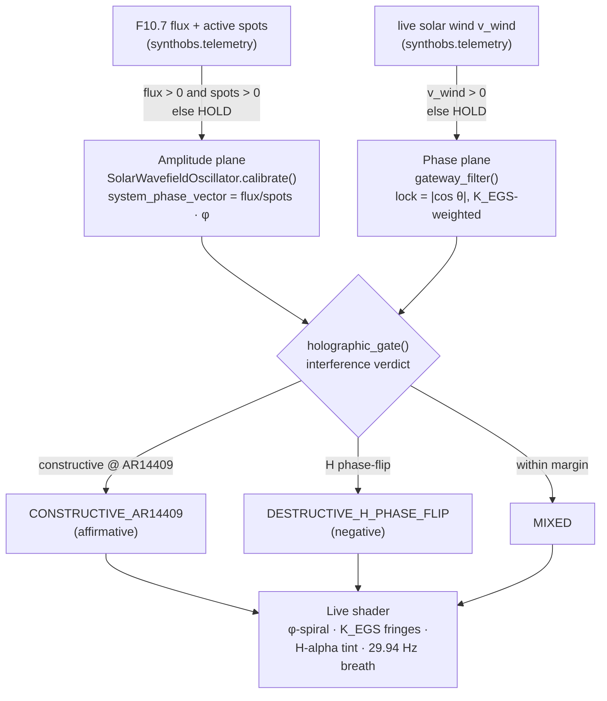

# The Solar Wavefield Oscillator & Real-Time Calibration {#sec:swo}

The software uses a live calibration boundary for current space-weather telemetry:
F10.7 radio flux, active sunspot regions, and bulk solar-wind speed. The Solar
Wavefield Oscillator (SWO) is the stateful adapter for those feeds. The provenance
chain is NOAA SWPC's public F10.7, sunspot, and RTSW products
[@noaaf107; @noaasunspot; @noaartsw], fetched natively through libcurl
[@libcurl].

## Real-Time Dependency Rule

The production telemetry path does not use historical databases, static baseline
logs as live control input. If network connectivity drops—or any reading is malformed,
stale, or non-physical—the system enters an
isolated **Hold State** and retains the last verified vector until a valid live
connection is re-established.

This fail-closed discipline is enforced at every layer. The telemetry ingestion
client (`synthobs.telemetry`) raises `TelemetryUnavailable` on a non-200 response, a
malformed payload, a non-positive flux or sunspot count, or a timestamp older than
the staleness horizon — it never substitutes a default. The native plugin's libcurl
thread applies the same rule: on any curl error it holds the last verified vector.

## Technical Calibration Logic

The calibration module processes active-region counts and solar radio flux to output
the bounded `system_phase_vector` used by the SynthOBS interface and FractiSynth core
filters. The amplitude plane is defined by @eq:swo-phase-vector:

$$
v_{\mathrm{phase}} = \frac{\Phi_{\mathrm{F10.7}}}{N_{\mathrm{spots}}} \cdot \varphi
$$ {#eq:swo-phase-vector}

The Python `SolarWavefieldOscillator.calibrate()` is the tested source of truth for
@eq:swo-phase-vector. The native plugin implements the OBS-bound counterpart in
the `fractisynth_swo_t` struct, scaling against the pinned `EGS_PHI` literal
(`1.61803398875f`); static and behavioral checks guard the shared contract:

```c
static bool synchronize_swo_calibration(fractisynth_swo_t *swo,
                                        float current_flux, int active_spots) {
    /* ENFORCEMENT: block any stale, default, zeroed, or non-finite indicator. */
    if (!isfinite(current_flux) || current_flux <= 0.0f || active_spots <= 0) {
        swo->is_calibrated = false;
        return false;                 /* escape to Hold Pattern — vector unchanged */
    }
    swo->active_f107_flux    = current_flux;
    swo->monitored_sunspots  = active_spots;
    swo->system_phase_vector = (current_flux / (float)active_spots) * EGS_PHI;
    swo->is_calibrated       = true;
    return true;
}
```

## Modulating Variables

When the admitted telemetry changes, the `system_phase_vector` changes on the next
accepted calibration. That value can update the visual shader displacement and
audio-reactivity paths; the implementation does not claim that the resulting media
state is a physical reflection of space-weather dynamics.

@fig:swo shows the calibration response across a swept range of solar flux for one,
three, and seven active regions — the phase vector that drives the whole wavefield.

{#fig:swo width=78%}

## The EGS Gateway — the Phase Plane

The flux-and-sunspot calibration above sets the *amplitude* plane. A second,
independent plane computes the *phase* of the modeled wavefield from the admitted
solar-wind value: the **El Gran Sol Gateway**. Here the system's defining constant is not the
golden ratio of layout but the **EGS Fractal Constant** — the dimensionless gateway
key $K_{\mathrm{EGS}}$ that bridges El Gran Sol's optical scale to hydrogen's H-alpha
geometry, defined in @eq:egs-gateway-key:

$$
K_{\mathrm{EGS}} = \varphi \cdot \frac{\lambda_{\text{reader}}}{\lambda_{\text{H-alpha}}}
= \varphi \cdot \frac{1030\ \text{nm}}{656.28\ \text{nm}} \approx 2.539427
$$ {#eq:egs-gateway-key}

The gateway injects the **live solar-wind speed** into a virtual 1030 nm reader model
as a phase bias, weighted by $K_{\mathrm{EGS}}$, and reports the resulting model lock
strength. @eq:gateway-lock is the phase plane:

$$
\theta = \left(2\pi \cdot \frac{v_{\text{wind}}}{400\ \text{km/s}} \cdot K_{\mathrm{EGS}}\right) \bmod 2\pi,
\qquad
\text{lock} = \lvert\cos\theta\rvert
$$ {#eq:gateway-lock}

In @eq:gateway-lock a perfect model lock ($\text{lock}=1$) means the computed phase
lands on a cosine maximum; a null ($\text{lock}=0$) means the computed phase is in
quadrature. These labels describe the application model, not a measurement of
hydrogen or solar-plasma phase.
Like the amplitude plane it fails closed — a non-positive wind speed holds the last
verified lock — and the two planes are fully decoupled: a wind dropout never disturbs
the phase vector, and a flux dropout never disturbs the gateway lock. @fig:gateway
sweeps the lock across the solar-wind range, marking the FractiAI nominal of
551.7 km/s.

{#fig:gateway width=78%}

{#fig:telemetry-pipeline width=90%}

{#fig:telemetry-thread width=90%}

The gateway resolves not to a Boolean but to a **holographic interference verdict** —
`holographic_gate()` reports constructive interference at the `AR14409` solar node as
the affirmative branch (`CONSTRUCTIVE_AR14409`), a destructive hydrogen phase-flip as
the negative (`DESTRUCTIVE_H_PHASE_FLIP`), and a within-margin beat as `MIXED`. That
lock strength then drives the live shader's declared effects: the φ-spiral displacement,
the $K_{\mathrm{EGS}}$-spaced interference fringes, the H-alpha-inspired tint, and a
gentle breathing pulse at the configured 29.94 Hz design frequency.

The two telemetry planes are fully decoupled — each fails closed and holds
independently — and converge only at the holographic gate that drives the shader:


<!-- alt: Independent telemetry planes: positive finite flux/spots and solar-wind inputs either update their respective SWO and gateway states or hold, then feed a named interference verdict and the live shader. -->

## Command-Line Calibration Override

The global terminal accepts a live override that flows through the same fail-closed
calibrator:

```text
/swo calibrate --flux=130 --spots=3 --target=AR4465
```

Non-physical overrides (`--flux=-1`, `--spots=0`) are rejected at parse time — the
terminal never silently no-ops.
