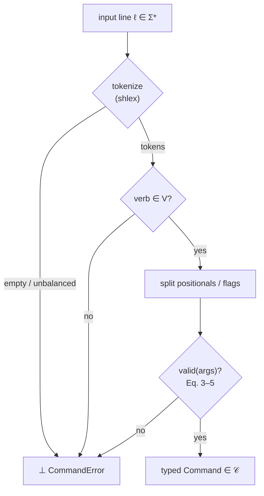

# Command Grammar: Telemetry, Parse Pipeline, and Summary {#sec:grammar-telemetry-parse-summary}

## Live Telemetry Overrides

```text
/swo calibrate --flux=130 --spots=3 --target=AR4465
```

Forces a manual Solar Wavefield Oscillator calibration, injecting an operator-chosen
F10.7 flux and active-region count in place of the live feed. Numeric flags
round-trip to their declared types — float `flux`, integer `spots` — and the
non-physical region of telemetry space is rejected outright:

$$
\mathrm{valid}_{\text{calibrate}}
\iff
\operatorname{finite}(\text{flux})
\;\land\;
(\,\text{flux} > 0\,)
\;\land\;
\text{spots} \in \mathbb{Z}_{>0}.
$$ {#eq:command_grammar-5}

Here `finite(flux)` excludes NaN and both infinities; `spots` is admitted only as a
positive integer. The parser also rejects duplicate or unknown flags and trailing
positionals before this predicate is evaluated.

The constraint in @eq:command_grammar-5 is the same Hold State the oscillator applies
to its live feed: a zeroed or negative reading never produces a phase vector. The
admitted `(flux, spots)` pair flows into the `system_phase_vector` law of the SWO
plane (Chapter 5), and from there the live solar wind drives the EGS Gateway phase
lock $\lvert\cos(\text{phase\_bias})\rvert$ governed by the gateway key
$K_{\mathrm{EGS}} = \varphi \cdot (\lambda_{\text{reader}}/\lambda_{\text{H-alpha}}) \approx 2.539427$.
The override can use any positive finite pair supplied by the operator; it is not
evidence that the pair is the current NOAA state. It does, however, reuse the same
parser and calibrator checks, so it cannot introduce a non-finite, zero, or negative
control vector through this command path.

## The Parse Pipeline

Every line walks the same deterministic path: tokenize, dispatch on the verb,
partition flags, validate, and either emit a typed command or refuse. The stages map
one-to-one onto @eq:command_grammar-1 and @eq:command_grammar-2.

![Rendered fail-closed parser pipeline for the complete four-verb grammar: `/mode`, `/transducer`, `/swo`, and `/dashboard`. The vertical path makes the successful sequence—raw line, balanced `shlex` tokenization, verb dispatch, verb-specific validation, and one of four typed command classes—explicit; the red side arrows show that malformed tokenization, unknown verbs, and invalid finite/range constraints all terminate at the same `CommandError` sink. The banner reports the four-verb/four-class contract and the three validation choke points.](../../output/figures/command_parse_pipeline.png){#fig:command-parser-pipeline width=92%}

Figure @fig:command-parser-pipeline renders the parser’s single rejection sink.
The accepted typed set is `{ModeCommand, BindCommand, CalibrateCommand,
DashboardCommand}`; malformed tokenization, unknown verbs, and invalid
verb-specific constraints all terminate as `CommandError`.

The same flow as a control graph, making the single $\bot$ sink explicit:


<!-- alt: Fail-closed command pipeline: tokenization and verb/argument validation send malformed input to one CommandError sink, while only fully validated lines become one of the four typed command classes. -->

## Grammar Summary

| Verb | Form | Result type | Admission rule |
| --- | --- | --- | --- |
| `/mode` | `--observatory \| --lab \| --ship` | `ModeCommand` | @eq:command_grammar-3 |
| `/transducer` | `bind <source> --ratio=<float>` | `BindCommand` | @eq:command_grammar-4 |
| `/swo` | `calibrate --flux=<float> --spots=<int> [--target=<id>]` | `CalibrateCommand` | @eq:command_grammar-5 |
| `/dashboard` | `plan \| build --name=<scene>` | `DashboardCommand` | non-empty name; action is `plan` or `build` |

Any other verb, a missing required argument, or an out-of-range value lands on the
$\bot$ branch of @eq:command_grammar-2 and raises `CommandError`. The persistent
command line therefore can never fail silently — a core safety property of the Vessel
Console, holographically continuous with the fail-closed gateway and oscillator
planes beneath it.
