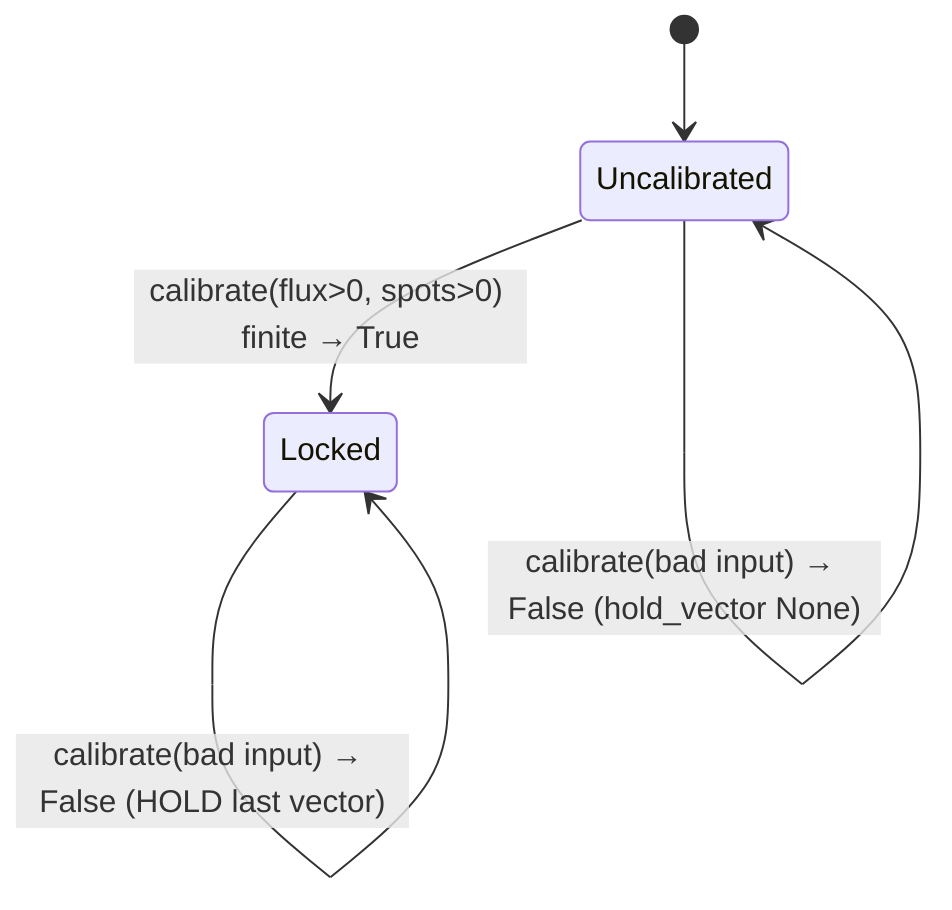

# Solar Telemetry & the Wavefield Oscillator

SynthOBS does not modulate on a timer or a guess — it phase-locks to **live solar
space weather**. This page documents the data source, the fail-closed contract, and
the oscillator that turns a reading into the system's single phase vector.

The two telemetry planes are independent and both fail closed:


## The data source — NOAA SWPC

Five public JSON feeds from the [NOAA Space Weather Prediction Center](https://www.swpc.noaa.gov/),
with the [real-time product catalogue](https://services.swpc.noaa.gov/json/rtsw/) serving
as the primary product boundary:

| Quantity                   | Endpoint                                                          | Drives                  |
| -------------------------- | ---------------------------------------------------------------- | ----------------------- |
| F10.7 cm solar radio flux  | `https://services.swpc.noaa.gov/json/f107_cm_flux.json`          | SWO amplitude plane     |
| Active solar regions       | `https://services.swpc.noaa.gov/json/solar_regions.json`         | SWO amplitude plane     |
| Solar-wind plasma          | `https://services.swpc.noaa.gov/json/rtsw/rtsw_wind_1m.json` | EGS gateway phase plane + wind/density/temperature graph series |
| GOES X-ray flux            | `https://services.swpc.noaa.gov/json/goes/primary/xrays-6-hour.json` | Solar Graph X-ray metric |
| Planetary K-index          | `https://services.swpc.noaa.gov/json/planetary_k_index_1m.json`  | Solar Graph Kp metric   |

The native C plugin polls all **five** every **60 seconds** from a background libcurl
thread. The Python engine fetches on demand. Flux + active-region count drive the SWO
amplitude vector; solar-wind speed drives the EGS gateway phase lock (see
[egs-gateway.md](egs-gateway.md)); wind/density/temperature, X-ray, and Kp populate
the Solar Graph feed. Both parsers consume the current RTSW object schema and ignore
inactive rows.

> **Active-region count, done right.** `solar_regions.json` carries one record per
> numbered region per day across ~a month. The count that drives the phase vector is the
> number of regions on the **latest observed date** (≈10), *not* the raw historical
> record/station-row count — counting those over-divides the phase vector (live-verified:
> 10 vs a 601-record over-count). Both the native `extract_active_region_count` and
> Python `parse_noaa_solar_regions` take the latest-date count, and both fail closed on an
> empty/malformed feed.

## The fail-closed contract

This is the heart of the design: **bad data never produces output.** There is no
averaging, no interpolation, no "last-known-good-but-pretend-it's-fresh." Every failure
mode collapses to one of two honest behaviors — *raise* (Python) or *hold* (the
oscillator and the C plugin).

`telemetry.py` raises `TelemetryUnavailable` on **any** of:

| Failure                         | What happens          |
| ------------------------------- | --------------------- |
| HTTP status ≠ 200               | `TelemetryUnavailable` |
| Malformed / unparseable payload | `TelemetryUnavailable` |
| `flux ≤ 0`                      | `TelemetryUnavailable` |
| `sunspots ≤ 0`                  | `TelemetryUnavailable` |
| Reading is stale (age > `DEFAULT_MAX_AGE_S`, 3 h) | `TelemetryUnavailable` |
| Timestamp in the future (age < −3 h) | `TelemetryUnavailable` |
| Non-finite/boolean measurement or fractional active-region count | `TelemetryUnavailable` |
| Non-finite/negative freshness window or HTTP timeout | `TelemetryUnavailable` |

It is tested with `pytest-httpserver` against **real local HTTP servers** returning
each of these conditions. A 500, a truncated body, a negative
flux, a zero sunspot count, and a stale timestamp each have a dedicated test asserting
the raise.

### API

```python
from synthobs.telemetry import (
    SolarTelemetry, TelemetryUnavailable,
    parse_noaa_f107_flux, telemetry_from_payload, fetch_live_telemetry,
    parse_noaa_plasma_series, parse_noaa_xray_flux, parse_noaa_kp_index,
)
```

- `parse_noaa_f107_flux(data) -> (flux, observed_at)` — validates an F10.7 payload.
- `telemetry_from_payload(...) -> SolarTelemetry` — builds a validated snapshot from raw NOAA JSON.
- `fetch_live_telemetry(...) -> SolarTelemetry` — performs the live HTTP fetch.
- `parse_noaa_plasma_series(data, *, max_age_s=..., now=...) -> (density, speed, temperature)`
  — sorts active RTSW rows chronologically and rejects stale/future rows; the explicit
  clock arguments make historical fixtures deterministic.
- `parse_noaa_xray_flux(data, band=...) -> list[float]` and
  `parse_noaa_kp_index(data) -> list[float]` — validate the real Solar Graph series
  and raise when no valid measurements remain.
- The public numeric boundary rejects Python/JSON booleans, non-finite values, and
  fractional active-region counts instead of allowing Python coercion to turn them
  into measurements. Freshness windows and HTTP timeouts must also be finite and
  non-negative/positive respectively.
- `SolarTelemetry.age_seconds(now) -> float` — staleness check used by the freshness gate.

## The Solar Wavefield Oscillator (SWO)

The oscillator turns a validated reading into **one number** — the *phase vector* —
that every downstream stage scales against. The full amplitude-plane pipeline:

{#fig:docs-telemetry-pipeline width=92%}

The kernel is `phase_vector(flux, spots)` in `synthobs.swo`, defined as
`(flux / spots) · φ`.

```python
from synthobs.swo import SolarWavefieldOscillator, phase_vector

osc = SolarWavefieldOscillator()
osc.calibrate(current_flux=142.0, active_spots=6)     # True → locks φ·(142/6) ≈ 38.34
osc.hold_vector()                                     # 38.34…
osc.calibrate(current_flux=-1.0, active_spots=6)      # False → HOLDS 38.34 (bad flux)
osc.hold_vector()                                     # still 38.34…
```

### The Hold State

`calibrate(current_flux, active_spots) -> bool` returns `True` and commits a new vector
**only** when both inputs are positive *and* the result is finite. On `current_flux ≤ 0`,
`active_spots ≤ 0`, or a non-finite result it returns `False`, sets `is_calibrated =
False`, and leaves `system_phase_vector` (the held value) **untouched**. Before any
successful calibration, `hold_vector()` is `None`.



This is what lets the rest of the system keep running smoothly through a telemetry
dropout: it simply keeps transducing against the last real reading rather than lurching
to a default.

## Provenance payload verification

The Telemetry HUD can embed a self-describing telemetry record into the blue-channel
least-significant bits of its rendered frame, guarded by an unkeyed
corruption-detecting SHA-256 checksum (it detects accidental corruption — a rescale,
a recompression, a flipped bit — not a deliberate forgery; there is no secret key).
The shared verifier extracts the payload, checks the SHA-256 checksum, validates the
record fields, and reports the same short signature shown on the HUD:

```bash
uv run python scripts/verify_provenance_strip.py \
  manuscript/assets/obs/obs_telemetry_hud.png --json --expect-signature 8b1f58c1
```

The tool accepts RGB or RGBA PNG captures and fails closed on missing images, malformed
pixel shapes, undersized buffers, checksum mismatch, or a signature mismatch supplied by
`--expect-signature`.

Callers that need deliberate-forgery resistance can opt into HMAC-SHA-256 with a secret
held outside the repository and manifests:

```bash
export SYNTHOBS_PROVENANCE_KEY='operator-held-secret'
uv run python scripts/verify_provenance_strip.py \
  capture.png --hmac-key-env SYNTHOBS_PROVENANCE_KEY --json
```

The native live HUD continues to emit the compact unkeyed checksum payload by default;
the keyed mode is an explicit verifier-side contract and never serializes the key.

The native HUD additionally paints a visible 32-cell signature strip derived from the
same 8-hex digest prefix. It is not a replacement for the LSB payload; it is a robust
capture fallback when live OBS compositing or screenshot rescaling destroys row-0 LSBs.

## The same contract, natively, in OBS

The C plugin (`plugin/fractisynth/src/fractisynth.c`) mirrors this exactly. Its
background libcurl thread (`telemetry_thread_fn`) runs this loop on a
`TELEMETRY_POLL_SECONDS` (= 60) cadence:

{#fig:docs-telemetry-thread width=92%}

- `synchronize_swo_calibration()` implements the identical formula
  `(current_flux / active_spots) * EGS_PHI` and the identical fail-closed guard
  `if (!isfinite(current_flux) || current_flux <= 0.0f || active_spots <= 0)` → hold.
- The amplitude lock fires only when `flux > 0.0f && spots > 0`; otherwise the thread
  logs `telemetry unavailable — holding last vector` and moves on. Any curl error,
  non-200, or parse failure leaves the fetched value non-positive, so it folds into the
  same hold path.
- **Reader-side enforcement (hardened):** consumers read the vector *and* the
  `is_calibrated` flag in one locked snapshot via `swo_read(float *out_vector)`. An
  uncalibrated oscillator contributes **zero** phase to the shader — so "no calibration
  ⇒ no modulation" is enforced where the value is *used*, not merely where it is
  written.

### Verified live

In a real OBS 32.1.2 session the telemetry thread reached NOAA and locked a vector
end-to-end — captured in the OBS log:

```
[fractisynth] SWO locked: flux=145.0 spots=10 phase=23.46
```

That is the entire pipeline — live HTTP → parse → fail-closed gate → φ·(flux/spots) →
phase vector — executing natively inside OBS. See [build-and-install.md](build-and-install.md).

> **Note on the C-side sunspot count.** The dependency-free C parser performs the same
> two-pass latest-date count as the Python engine: find the maximum `observed_date`, then
> count only records on that date. The standalone RTSW parser header is compiled and
> behaviorally compared with the Python parser over current, stale, future, inactive, and
> malformed rows.
