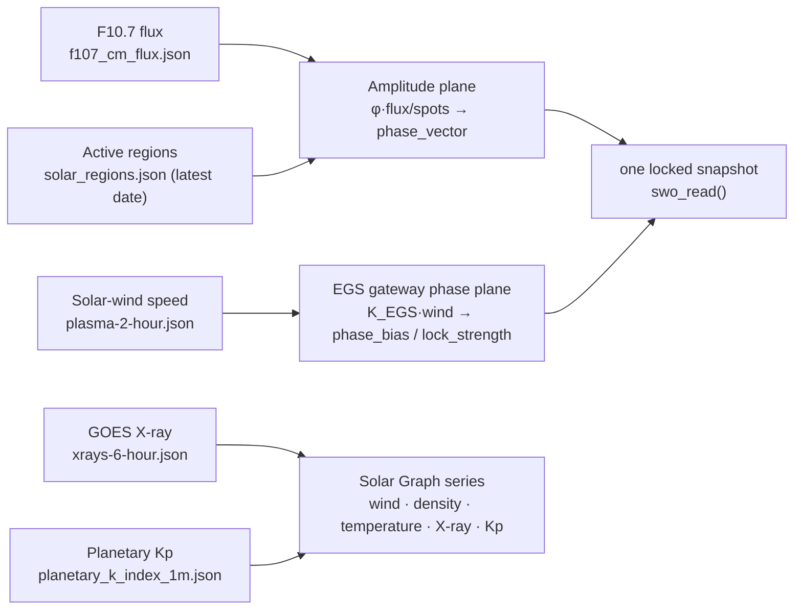
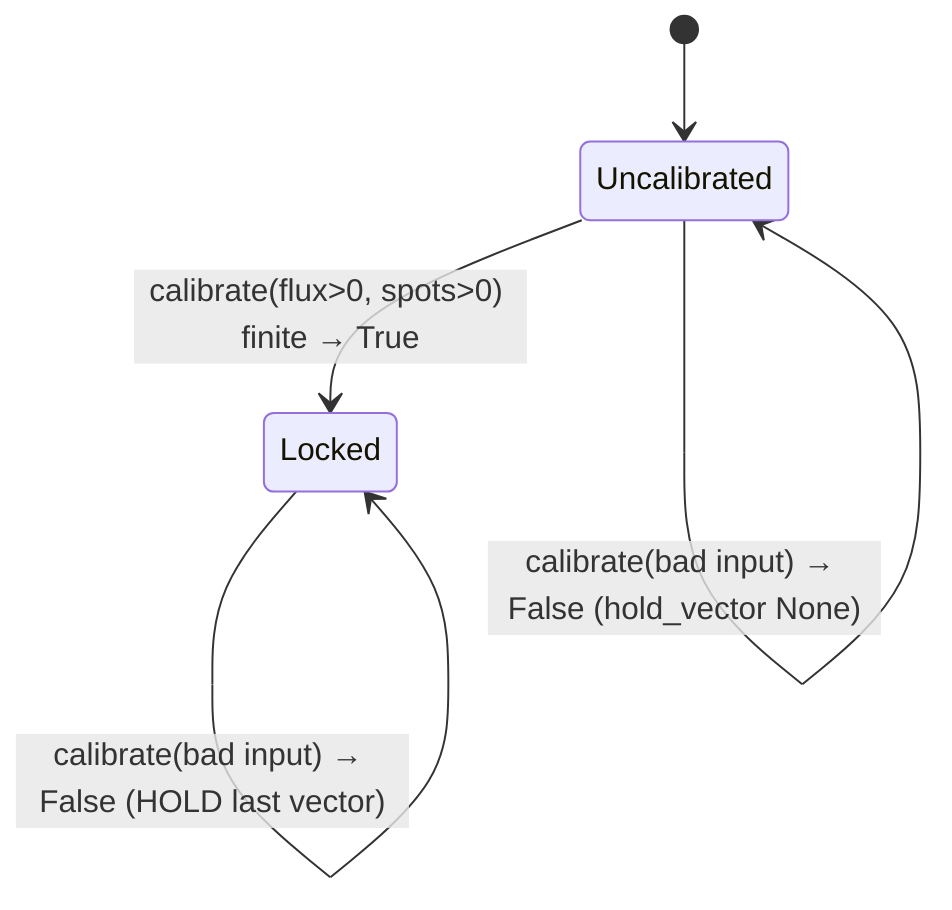

# Solar Telemetry & the Wavefield Oscillator

SynthOBS does not modulate on a timer or a guess — it phase-locks to **live solar
space weather**. This page documents the data source, the fail-closed contract, and
the oscillator that turns a reading into the system's single phase vector.

The two telemetry planes are independent and both fail closed:



## The data source — NOAA SWPC

Five public JSON feeds from the NOAA Space Weather Prediction Center:

| Quantity                   | Endpoint                                                          | Drives                  |
| -------------------------- | ---------------------------------------------------------------- | ----------------------- |
| F10.7 cm solar radio flux  | `https://services.swpc.noaa.gov/json/f107_cm_flux.json`          | SWO amplitude plane     |
| Active solar regions       | `https://services.swpc.noaa.gov/json/solar_regions.json`         | SWO amplitude plane     |
| Solar-wind plasma          | `https://services.swpc.noaa.gov/products/solar-wind/plasma-2-hour.json` | EGS gateway phase plane + wind/density/temperature graph series |
| GOES X-ray flux            | `https://services.swpc.noaa.gov/json/goes/primary/xrays-6-hour.json` | Solar Graph X-ray metric |
| Planetary K-index          | `https://services.swpc.noaa.gov/json/planetary_k_index_1m.json`  | Solar Graph Kp metric   |

The native C plugin polls all **five** every **60 seconds** from a background libcurl
thread. The Python engine fetches on demand. Flux + active-region count drive the SWO
amplitude vector; solar-wind speed drives the EGS gateway phase lock (see
[egs-gateway.md](egs-gateway.md)); wind/density/temperature, X-ray, and Kp populate
the Solar Graph feed.

> **Active-region count, done right.** `solar_regions.json` carries one record per
> numbered region per day across ~a month. The count that drives the phase vector is the
> number of regions on the **latest observed date** (≈10), *not* the raw record count and
> *not* the hundreds of per-station rows in `sunspot_report.json` — counting those
> over-divides the phase vector (live-verified: 10 vs a 601-record over-count). Both the
> native `extract_active_region_count` and Python `parse_noaa_solar_regions` take the
> latest-date count, and both fail closed on an empty/malformed feed.

## The fail-closed contract

This is the heart of the design: **bad data never produces output.** There is no
averaging, no interpolation, no "last-known-good-but-pretend-it's-fresh." Every failure
mode collapses to one of two honest behaviors — *raise* (Python) or *hold* (the
oscillator and the C plugin).

`telemetry.py` raises `TelemetryUnavailable` on **any** of:

| Failure                         | What happens          |
| ------------------------------- | --------------------- |
| HTTP status ≠ 200               | `TelemetryUnavailable` |
| Malformed / unparseable payload | `TelemetryUnavailable` |
| `flux ≤ 0`                      | `TelemetryUnavailable` |
| `sunspots ≤ 0`                  | `TelemetryUnavailable` |
| Reading is stale (age > `DEFAULT_MAX_AGE_S`, 3 h) | `TelemetryUnavailable` |
| Timestamp in the future (age < −3 h) | `TelemetryUnavailable` |

It is tested with `pytest-httpserver` against **real local HTTP servers** returning
each of these conditions — there are no mocks. A 500, a truncated body, a negative
flux, a zero sunspot count, and a stale timestamp each have a dedicated test asserting
the raise.

### API

```python
from synthobs.telemetry import (
    SolarTelemetry, TelemetryUnavailable,
    parse_noaa_f107_flux, telemetry_from_payload, fetch_live_telemetry,
)
```

- `parse_noaa_f107_flux(data) -> (flux, observed_at)` — validates an F10.7 payload.
- `telemetry_from_payload(...) -> SolarTelemetry` — builds a validated snapshot from raw NOAA JSON.
- `fetch_live_telemetry(...) -> SolarTelemetry` — performs the live HTTP fetch.
- `SolarTelemetry.age_seconds(now) -> float` — staleness check used by the freshness gate.

## The Solar Wavefield Oscillator (SWO)

The oscillator turns a validated reading into **one number** — the *phase vector* —
that every downstream stage scales against. The full amplitude-plane pipeline:

```
   live HTTP          parse + fail-closed gate           kernel
┌──────────────┐   ┌───────────────────────────┐   ┌──────────────────┐
│ NOAA F10.7   │   │ flux > 0 ?                 │   │                  │
│  + sunspots  │──▶│ sunspots > 0 ?            ─┼──▶│ φ · (flux/spots) │──▶ phase_vector
│  (JSON)      │   │ fresh (age ≤ 3 h) ?        │   │                  │
└──────────────┘   └───────────────────────────┘   └──────────────────┘
                              │ any check fails
                              ▼
                      raise TelemetryUnavailable  ──▶  Hold State (keep last vector)
```

The kernel is `phase_vector(flux, spots)` in `synthobs.swo`, defined as
`(flux / spots) · φ`.

```python
from synthobs.swo import SolarWavefieldOscillator, phase_vector

osc = SolarWavefieldOscillator()
osc.calibrate(current_flux=142.0, active_spots=601)   # True → locks φ·(142/601) ≈ 0.382
osc.hold_vector()                                     # 0.382…
osc.calibrate(current_flux=-1.0, active_spots=601)    # False → HOLDS 0.382 (bad flux)
osc.hold_vector()                                     # still 0.382…
```

### The Hold State

`calibrate(current_flux, active_spots) -> bool` returns `True` and commits a new vector
**only** when both inputs are positive *and* the result is finite. On `current_flux ≤ 0`,
`active_spots ≤ 0`, or a non-finite result it returns `False`, sets `is_calibrated =
False`, and leaves `system_phase_vector` (the held value) **untouched**. Before any
successful calibration, `hold_vector()` is `None`.



This is what lets the rest of the system keep running smoothly through a telemetry
dropout: it simply keeps transducing against the last real reading rather than lurching
to a default.

## The same contract, natively, in OBS

The C plugin (`plugin/fractisynth/src/fractisynth.c`) mirrors this exactly. Its
background libcurl thread (`telemetry_thread_fn`) runs this loop on a
`TELEMETRY_POLL_SECONDS` (= 60) cadence:

```
┌─ telemetry_thread_fn (every 60 s) ───────────────────────────────────┐
│  fetch F10.7 ─┐                                                        │
│  fetch spots ─┼─▶ flux>0 && spots>0 ? ─yes─▶ synchronize_swo_         │
│               │                              calibration() → lock      │
│               └─────────────────────  no ──▶ log "telemetry           │
│                                              unavailable — holding     │
│                                              last vector"              │
│  fetch wind ─────▶ wind>0 ? ─yes─▶ synchronize_gateway_lock()          │
│                            └─ no ─▶ hold last gateway lock             │
│  fetch series ───▶ valid rows ? ─yes─▶ store wind/density/temp/X-ray/Kp │
│                            └─ no ─▶ keep last graph series             │
└───────────────────────────────────────────────────────────────────────┘
```

- `synchronize_swo_calibration()` implements the identical formula
  `(current_flux / active_spots) * EGS_PHI` and the identical fail-closed guard
  `if (current_flux <= 0.0f || active_spots <= 0)` → hold.
- The amplitude lock fires only when `flux > 0.0f && spots > 0`; otherwise the thread
  logs `telemetry unavailable — holding last vector` and moves on. Any curl error,
  non-200, or parse failure leaves the fetched value non-positive, so it folds into the
  same hold path.
- **Reader-side enforcement (hardened):** consumers read the vector *and* the
  `is_calibrated` flag in one locked snapshot via `swo_read(float *out_vector)`. An
  uncalibrated oscillator contributes **zero** phase to the shader — so "no calibration
  ⇒ no modulation" is enforced where the value is *used*, not merely where it is
  written.

### Verified live

In a real OBS 32.1.2 session the telemetry thread reached NOAA and locked a vector
end-to-end — captured in the OBS log:

```
[fractisynth] SWO locked: flux=142.0 spots=601 phase=0.3823
```

That is the entire pipeline — live HTTP → parse → fail-closed gate → φ·(flux/spots) →
phase vector — executing natively inside OBS. See [build-and-install.md](build-and-install.md).

> **Note on the C-side sunspot count.** The dependency-free C parser performs the same
> two-pass latest-date count as the Python engine: find the maximum `observed_date`, then
> count only records on that date. A production build can still switch to a real JSON
> parser for maintainability; the tested fail-closed behavior is already mirrored.
