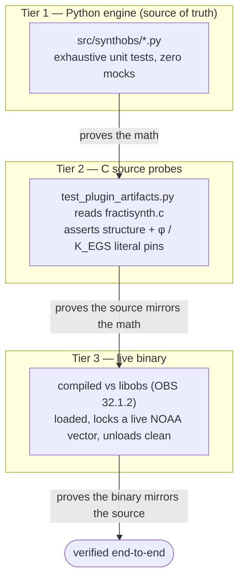

# Testing

SynthOBS treats its Python engine as the source of truth, so the engine is tested
exhaustively and with **zero mocks**. The native C plugin is verified by static
structural probes plus a live OBS load.

Three tiers of verification, weakest claim first:



## Run the suite

```bash
cd projects/working/SynthOBS
# the project ships a local venv; or use uv
PYTHONPATH="$PWD/src" python -m pytest tests/ -q
```

Current state: **889 passed**, **94.70 % coverage** (≥ 90 % gate), ruff clean.

```bash
# with coverage gate
PYTHONPATH="$PWD/src" python -m pytest tests/ \
  --cov=src/synthobs --cov-report=term-missing --cov-fail-under=90
```

## Test layout

The suite is split by layer — geometry, telemetry, signal, console, orchestration,
the cross-layer gateway, and the native artifacts. Each row's ISC range is the one
annotated in that file's own test bodies.

The **Tests** column is the *collected* count (parametrized cases expand — e.g.
`test_constants_and_layout.py` fans 15 functions across the φ-geometry grid into 737
cases), so the column sums to the full 889-test suite.

| File                                     | Tests | ISCs         | Covers                                                                                                  |
| ---------------------------------------- | ----: | ------------ | ------------------------------------------------------------------------------------------------------- |
| `tests/test_constants_and_layout.py`     |   737 | 1–2, 3–10    | φ constants single-source + Goldilocks split, recursive subdivision, spiral, viewport tiling            |
| `tests/test_telemetry.py`                |    21 | 11–18        | fail-closed NOAA F10.7 client — every failure mode raises `TelemetryUnavailable`                        |
| `tests/test_swo_and_dsp.py`              |    44 | 19–32        | oscillator phase formula + Hold State; φ soft limiter, scale matrix, calibrated dims                    |
| `tests/test_console_and_commands.py`     |    37 | 33–48        | 3 modes × 7 buttons + the `/mode` `/transducer` `/swo` grammar, fail-closed parsing                     |
| `tests/test_engine.py`                   |     9 | 49–54        | calibrate / hold, layout, pre-calibration modulation refusal                                            |
| `tests/test_gateway_and_interference.py` |    28 | 91–110       | EGS gateway key K_EGS, `lock_strength = \|cos(phase_bias)\|`, holographic verdict, live solar-wind feed |
| `tests/test_plugin_artifacts.py`         |    13 | 55–64, 93–94 | native C plugin static structure + obspython bridge, both literal pins (φ and K_EGS)                    |
| **Total**                                | **889** |            |                                                                                                         |

## The no-mocks policy

No `MagicMock`, no `mocker.patch`, no `unittest.mock` — anywhere. Every test uses real
data and real computation. The patterns:

- **HTTP / telemetry** — `pytest-httpserver` spins up a real local server returning
  200s, 500s, truncated bodies, negative flux, zero spots, stale timestamps. The
  fail-closed client is tested against actual HTTP responses, not stubs.
- **Numerics** — the limiter, the oscillator, and the layout are tested with concrete
  inputs (including `±1e9`, `±inf`, `nan`) and exact expected outputs.
- **The C plugin** — `test_plugin_artifacts.py` reads `fractisynth.c` and asserts the
  real structure: the video and audio filters registered (`obs_register_source(&fractisynth_video_filter)`
  / `…audio_filter`), `.video_render = fsv_video_render` and `.filter_audio = fsa_filter_audio`
  wired, the `/ EGS_PHI` viewport calibration, the `tanhf` soft limiter, the shared
  `swo_phase_vector()` read into `system_phase_vector`, and — critically — that the φ literal
  `#define EGS_PHI 1.61803398875f` matches the Python `PHI` to within `1e-9` (ISC-60), the
  K_EGS literal `#define EGS_GATEWAY_KEY 2.53942700f` matches `EGS_GATEWAY_KEY` (ISC-93), and the
  fail-closed guard `if (current_flux <= 0.0f || active_spots <= 0)` is present (ISC-61).
- **The obspython bridge** — compiled with `py_compile`, imported (its `obspython`
  guard keeps it importable), and driven through `apply_command` end-to-end into the
  real engine.

## The φ pin between layers

The single most important invariant test: the C plugin's φ literal must equal the Python
`PHI`. `constants.PHI_C_LITERAL = "1.61803398875"` records exactly what the C source
hard-codes, and `test_phi_literal_matches_python` asserts both that the literal is in the
C source *and* that it equals `PHI` numerically. If anyone edits either side, the test
fails — drift between the engine and the transducer can never pass silently.

```
          Python (truth)                      C plugin (mirror)
   ┌────────────────────────────┐       ┌────────────────────────────┐
   │ constants.PHI              │       │ #define EGS_PHI            │
   │   = 1.61803398875          │       │   1.61803398875f          │
   │ constants.PHI_C_LITERAL    │       │                           │
   │   = "1.61803398875"        │       │ #define EGS_GATEWAY_KEY    │
   │ constants.EGS_GATEWAY_KEY  │       │   2.53942700f             │
   │   = φ·(1030/656.28)        │       │                           │
   └─────────────┬──────────────┘       └─────────────┬─────────────┘
                 │                                     │
                 └──────────────┬──────────────────────┘
                                ▼
               tests/test_plugin_artifacts.py
        ┌──────────────────────────────────────────────────┐
        │ test_phi_literal_matches_python          (ISC-60) │  φ pin
        │ test_egs_gateway_key_literal_matches_…   (ISC-93) │  K_EGS pin
        └──────────────────────────────────────────────────┘
                  edit either side → test FAILS
```

## Native build verification (beyond unit tests)

Static probes prove the C *source* is correct; a live OBS load proves the *binary* is.
The plugin was compiled against real `libobs` (OBS 32.1.2), installed, and loaded — with
the module appearing in OBS's `Loaded Modules` list and the telemetry thread locking a
live NOAA vector, then unloading without hanging shutdown. The procedure and the captured
log are in [build-and-install.md](build-and-install.md).

## Adding a test

Follow the existing pattern — real data, exact assertions, fixed seeds where randomness
is involved:

```python
from synthobs.dsp import phi_soft_limit_sample

def test_soft_limiter_never_exceeds_ceiling():
    for x in (-1e9, -2.0, 0.0, 0.5, 2.0, 1e9, float("inf"), float("-inf")):
        out = phi_soft_limit_sample(x, threshold=1.0)
        assert abs(out) <= 1.0
```
