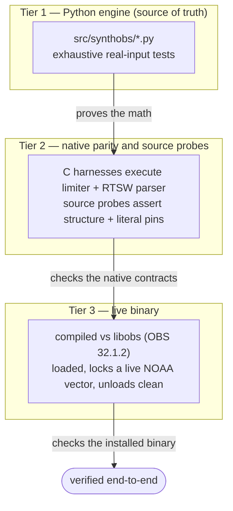

# Testing

SynthOBS treats its Python engine as the source of truth, so the engine is tested
exhaustively against real inputs. The native C plugin is verified by executable C
parity harnesses, structural probes, a native build, and a live OBS load.

Three tiers of verification, weakest claim first:



## Run the suite

```bash
cd projects/working/SynthOBS
# the project ships a local venv; or use uv
PYTHONPATH="$PWD/src" python -m pytest tests/ -q
```

Current state: **1217 passed**, **96.09 % coverage** (≥ 90 % gate).

```bash
# with coverage gate (module invocation avoids stale console-script shebangs in symlinked worktrees)
uv run python -m pytest tests/ --cov=synthobs --cov-fail-under=90
```

## Test layout

The suite is split by layer — geometry, telemetry, signal, console, orchestration,
the cross-layer gateway, interaction targets, dashboard planning, documentation
contracts, provenance, history, and the native artifacts. Each row's ISC range is
the one annotated in that file's own test bodies where an ISC range applies.

The **Tests** column is the *collected* count (parametrized cases expand — e.g.
`test_constants_and_layout.py` fans geometry invariants across the φ grid into 742
cases), so the column sums to the full 1217-test suite.

| File                                     | Tests | ISCs         | Covers                                                                                                  |
| ---------------------------------------- | ----: | ------------ | ------------------------------------------------------------------------------------------------------- |
| `tests/test_constants_and_layout.py`     |   742 | 1–2, 3–10    | φ constants single-source + Goldilocks split, recursive subdivision, spiral, viewport tiling            |
| `tests/test_telemetry.py`                |    50 | 11–18        | fail-closed NOAA F10.7, solar-wind, and non-finite telemetry parsing                                    |
| `tests/test_swo_and_dsp.py`              |    67 | 19–32        | oscillator phase formula + Hold State; φ soft limiter, post-limiter audio envelope, scale matrix, calibrated dims |
| `tests/test_console_and_commands.py`     |    47 | 33–48        | 3 modes × 7 buttons + `/mode`, `/transducer`, `/swo`, `/dashboard`, fail-closed parsing                 |
| `tests/test_engine.py`                   |    10 | 49–54        | calibrate / hold, layout, pre-calibration modulation refusal                                            |
| `tests/test_gateway_and_interference.py` |    47 | 91–110       | EGS gateway key K_EGS, `lock_strength = \|cos(phase_bias)\|`, holographic verdict, live solar-wind feed |
| `tests/test_solar_series.py`             |    20 | —            | NOAA plasma, GOES X-ray, and Kp time-series parsers for Solar Graph metrics                            |
| `tests/test_history.py`                  |    32 | —            | bounded telemetry history, eviction, normalization, and latest-sample behavior                          |
| `tests/test_provenance.py`               |    53 | —            | telemetry record packing, checksum/HMAC authenticity modes, LSB/visible-signature contracts, integrity + fail-closed validation |
| `tests/test_provenance_verify_tool.py`   |     6 | —            | real PNG provenance-strip verification, RGB/RGBA screenshot handling, CLI signature/HMAC rejection  |
| `tests/test_interaction_and_layers.py`   |    24 | —            | seven feed targets, layer rail, marker drop, dashboard plans, dashboard command dry-runs                |
| `tests/test_plugin_artifacts.py`         |    23 | 55–64, 93–94 | native C plugin/source static structure, optional real C syntax smoke, audio-reactive uniforms + envelope release hold, X-ray/Kp wiring, graph axes, inspector, dock, obspython bridge, φ/K_EGS pins |
| `tests/test_fail_closed_fuzz.py`         |    45 | 145–154, 183 | adversarial NaN/±Inf battery across parser, telemetry (incl. the sunspots `int()` boundary), Kp, gateway, SWO, interaction, and provenance boundaries, with positive controls |
| `tests/test_c_parity_behavioral.py`      |    15 | 57–58        | compiles the real C limiter and standalone RTSW parser, asserting parity with Python across adversarial and freshness fixtures |
| `tests/test_docs_contracts.py`           |    18 | —            | markdown links, generated figure and asset manifests, scholarship ledger and CFF metadata, public-release metadata and install path, no-box-drawing and cover guards, citation resolution, parser/gate documentation, canonical TODO and stale status-baseline guards, a measured-vs-documented test-count check, cross-reference uniqueness/resolution, and the stdlib-only-engine packaging guard |
| `tests/test_lean_invariants.py`          |     3 | —            | Lean scaffold has no `sorry` / custom `axiom`, `lake build` passes when Lake is available, and the Lean φ/K_EGS literals are bound to the Python constants |
| `tests/test_obs_scenario_probe.py`       |     4 | —            | live scenario manifest schema, skip semantics, and `--require-live` exit behavior                       |
| `tests/test_verification.py`             |    11 | —            | audio-meter ROI delta oracle, live-gate result validation, and fail-closed `ValueError` guards (bad metrics, dims, channels, ROI) — 100% of `verification.py` |
| **Total**                                | **1217** |          |                                                                                                         |

## The real-input policy

Every test uses real data, real computation, and real HTTP responses. The patterns:

- **HTTP / telemetry** — `pytest-httpserver` spins up a real local server returning
  200s, 500s, truncated bodies, negative flux, zero spots, stale timestamps. The
  fail-closed client is tested against actual HTTP responses from that server.
- **Numerics** — the limiter, the oscillator, and the layout are tested with concrete
  inputs (including `±1e9`, `±inf`, `nan`) and exact expected outputs.
- **The C plugin** — `test_plugin_artifacts.py` reads `fractisynth.c` and asserts the
  real structure: the video and audio filters registered (`obs_register_source(&fractisynth_video_filter)`
  / `…audio_filter`), `.video_render = fsv_video_render` and `.filter_audio = fsa_filter_audio`
  wired, the `/ EGS_PHI` viewport calibration, the `tanhf` soft limiter, the shared
  `swo_phase_vector()` read into `system_phase_vector`, and — critically — that the φ literal
  `#define EGS_PHI 1.61803398875f` matches the Python `PHI` to within `1e-9` (ISC-60), the
  K_EGS literal `#define EGS_GATEWAY_KEY 2.53942700f` matches `EGS_GATEWAY_KEY` (ISC-93), and the
  fail-closed guard `if (!isfinite(current_flux) || current_flux <= 0.0f || active_spots <= 0)` is present (ISC-61),
  the console exposes all 7 feed cells, marker, layer, and audio-reactive uniforms are wired, Solar Graph
  X-ray/Kp series and metric-aware time axes are pinned, and the native dock/inspector
  controls are statically guarded.
- **The obspython bridge** — compiled with `py_compile`, imported (its `obspython`
  guard keeps it importable), and driven through `apply_command` end-to-end into the
  real engine, including `/dashboard plan` dry-run summaries outside OBS.
- **Documentation contracts** — local markdown links must resolve, the manuscript's
  figure references must match `scripts.generate_figures.FIGURE_FILES`, and current
  status docs cannot retain stale test-count or coverage baselines.
- **Provenance verifier** — `scripts/verify_provenance_strip.py` is exercised against
  real PNG files written through matplotlib image I/O; RGB screenshots are converted to
  RGBA bytes before the shared `extract_lsb` / `verify_payload` path runs.
- **Lean scaffold** — when `lake` is installed, `tests/test_lean_invariants.py` runs
  `lake build` in `lean/` and rejects proof placeholders. The default Python engine
  remains the runtime source of truth.

## The φ pin between layers

The single most important invariant test: the C plugin's φ literal must equal the Python
`PHI`. `constants.PHI_C_LITERAL = "1.61803398875"` records exactly what the C source
hard-codes, and `test_phi_literal_matches_python` asserts both that the literal is in the
C source *and* that it equals `PHI` numerically. If anyone edits either side, the test
fails — drift between the engine and the transducer can never pass silently.

{#fig:docs-parity-bridge width=92%}

## Native build verification (beyond unit tests)

Static probes prove the C *source* structure; the optional local syntax smoke test
(`test_native_c_syntax_compiles_when_matching_sdk_is_available`) compiles the real
translation unit when the pinned OBS/SIMDe/libcurl headers are present; a live OBS
load proves the *binary* is. The compile smoke is an explicit skip on a clean
checkout without that native SDK, never a disguised pass.
The plugin was compiled against real `libobs` (OBS 32.1.2), installed, and loaded — with
the module appearing in OBS's `Loaded Modules` list and the telemetry thread locking a
live NOAA vector, then unloading without hanging shutdown. The procedure and the captured
log are in [build-and-install.md](build-and-install.md).

## Manual live gates

These checks are intentionally outside mandatory CI because they require a live OBS
process:

```bash
uv run python scripts/obs_ws_probe.py --scene FractiSynthTest --out output/live/obs_scene.png
uv run python scripts/verify_provenance_strip.py \
  manuscript/assets/obs/obs_telemetry_hud.png --json --expect-signature 8b1f58c1
uv run python scripts/obs_scenario_probe.py \
  --out output/live/$(date -u +%Y%m%dT%H%M%SZ) \
  --verify-audio --verify-provenance
```

The first captures rendered scene pixels through obs-websocket. The second verifies a
Telemetry HUD PNG whose LSB strip survived capture. The scenario harness creates/selects
an isolated verification scene, fits a `fractisynth_console` source to the OBS base
canvas, captures `scene_render.png`, `audio_silent.png`, `audio_tone.png`,
`telemetry_hud.png`, and writes a `manifest.json` with explicit `pass` / `fail` / `skip`
gates. Skips, missing required gates, and visually blank screenshots are non-fatal unless
`--require-live` is supplied, which becomes actionable under [`TODO.md`](../TODO.md)
once a headless OBS target exists.

## Adding a test

Follow the existing pattern — real data, exact assertions, fixed seeds where randomness
is involved:

```python
from synthobs.dsp import phi_soft_limit_sample

def test_soft_limiter_never_exceeds_ceiling():
    for x in (-1e9, -2.0, 0.0, 0.5, 2.0, 1e9, float("inf"), float("-inf")):
        out = phi_soft_limit_sample(x, threshold=1.0)
        assert abs(out) <= 1.0
```
