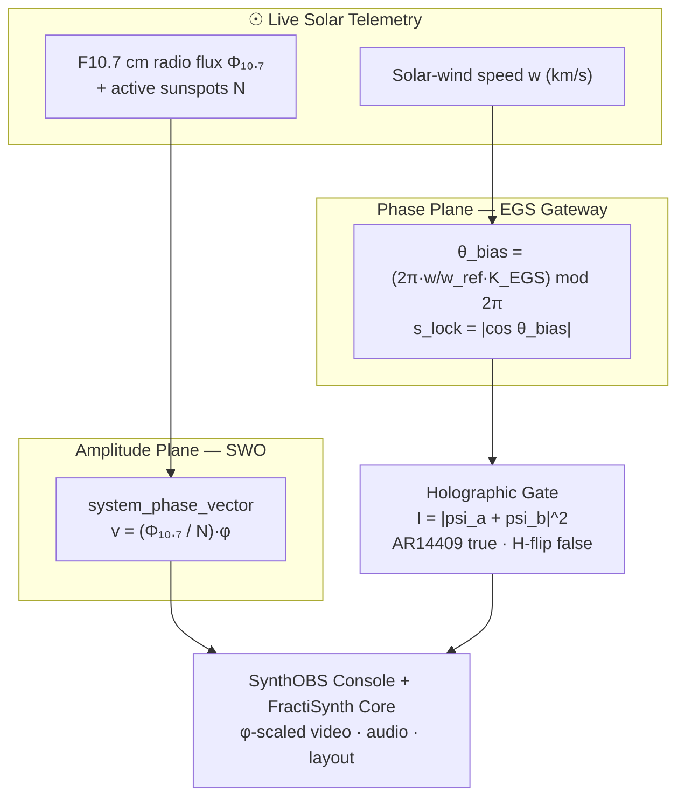

# Abstract {#sec:abstract}

**Author affiliation:** FractiAI / Active Inference Institute.

Modern broadcasting platforms such as OBS Studio expose a modular host and plugin
surface rather than a single monolith [@obsstudio; @obsmodules]. This blueprint
specifies SynthOBS and FractiSynth as a bounded extension of that surface: a
three-mode operator console, a native video/audio transducer, fail-closed telemetry
adapters, and a reproducible evidence protocol. The Observatory, Laboratory, and
Expedition Ship names describe the operator modes; they are interface vocabulary,
not claims about the physical environment.

The portable geometry and DSP contracts use **the golden-ratio constant**
$\varphi = 1.618\ldots$. It determines integer viewport splits, the video scale
factor, the audio-limiter knee, and the deterministic spiral. The native plugin also
uses a distinct EGS gateway key for its solar-wind phase calculation. These are
engineering choices; the manuscript does not infer perceptual or broadcast-quality
benefits from the ratio.
Phase locking is governed by a *distinct* second constant, the **EGS Fractal Constant**
— the dimensionless gateway key

$$
K_{\mathrm{EGS}} = \varphi \cdot \frac{\lambda_{\text{reader}}}{\lambda_{\text{H-alpha}}}
= \varphi \cdot \frac{1030\ \text{nm}}{656.28\ \text{nm}} \approx 2.539427
$$ {#eq:abstract-egs-key}

which bridges El Gran Sol's 1030 nm optical reader scale to hydrogen's H-alpha line
using the NIST wavelength reference [@nisthalpha].
The system models **two decoupled planes**. A centralized **Solar Wavefield
Oscillator (SWO)** reads current, bounded space-weather products — the F10.7 cm
solar radio flux and active-region counts — to compute the *amplitude* plane's phase vector

$$
v_{\text{phase}} = \frac{\Phi_{10.7}}{N_{\text{spots}}} \cdot \varphi
$$ {#eq:abstract-swo-vector}

while the **El Gran Sol Gateway** maps an accepted solar-wind speed onto the
*phase* plane through @eq:abstract-egs-key:

$$
\theta_{\text{bias}} = \left(2\pi \cdot \frac{w}{w_{\text{ref}}} \cdot K_{\mathrm{EGS}}\right) \bmod 2\pi,
\qquad
s_{\text{lock}} = \lvert\cos\theta_{\text{bias}}\rvert
$$ {#eq:abstract-gateway-lock}

The two planes are deliberately independent: a solar-wind dropout does not overwrite
the SWO vector, and invalid telemetry does not create a new lock. The gateway then
resolves a named interference outcome rather than returning a raw Boolean: a node
field $\psi$ is superposed at the AR14409 solar node against a hydrogen phase-flip,
and the verdict follows the interference intensity

$$
I = \lvert \psi_a + \psi_b \rvert^2
$$ {#eq:abstract-interference}

where constructive interference at AR14409 reads "true", a destructive hydrogen
phase-flip reads "false", and a tie resolves to a mixed (fail-closed) state.

The two-plane lock and its downstream consumers are organized as follows:

<!-- alt: Two-plane telemetry model: NOAA flux and active-region data calibrate the SWO amplitude plane, solar-wind speed drives the independent EGS phase plane, and both converge at the declared gate before reaching the console and transducer. -->

The architecture is decoupled and dual-layer: **SynthOBS**, the Vessel Console, uses
a recursive golden-ratio layout matrix whose primary region receives the major
integer share; **FractiSynth**, the Transducer Core, is a native `libobs` plugin that
implements the declared video and audio kernels at the host boundary. This blueprint
specifies both layers, the three modality control decks (three common and four unique
buttons per deck), the global command grammar, and the calibration loop. Executable
claims are tied to the tested Python engine through declared constant, static,
behavioral, and live-OBS contracts. The native plugin is a separate C implementation;
the Python engine remains the portable source of truth.

The resulting artifact is intended to be read as research software as well as an OBS
extension: the source tree, version metadata, tests, evidence manifest, and manuscript
are one citable object. The repository-level citation surface follows established
software-citation principles for credit, version specificity, persistence, and
accessibility [@smith2016softwarecitation], with machine-readable metadata in
`CITATION.cff` [@cffschema].

The planned public v1 distribution target is the GitHub repository
[`docxology/SynthOBS`](https://github.com/docxology/SynthOBS). That repository is
intended to be the canonical public source for the engine, native plugin,
obspython bridge, tests, installation instructions, manuscript, and versioned
evidence metadata; the release boundary and remaining acceptance work are recorded
in [`RELEASE.md`](../RELEASE.md).

**Keywords:** OBS Studio, golden ratio, El Gran Sol fractal constant, Solar
Wavefield Oscillator, space-weather telemetry, real-time DSP, broadcast engineering.
