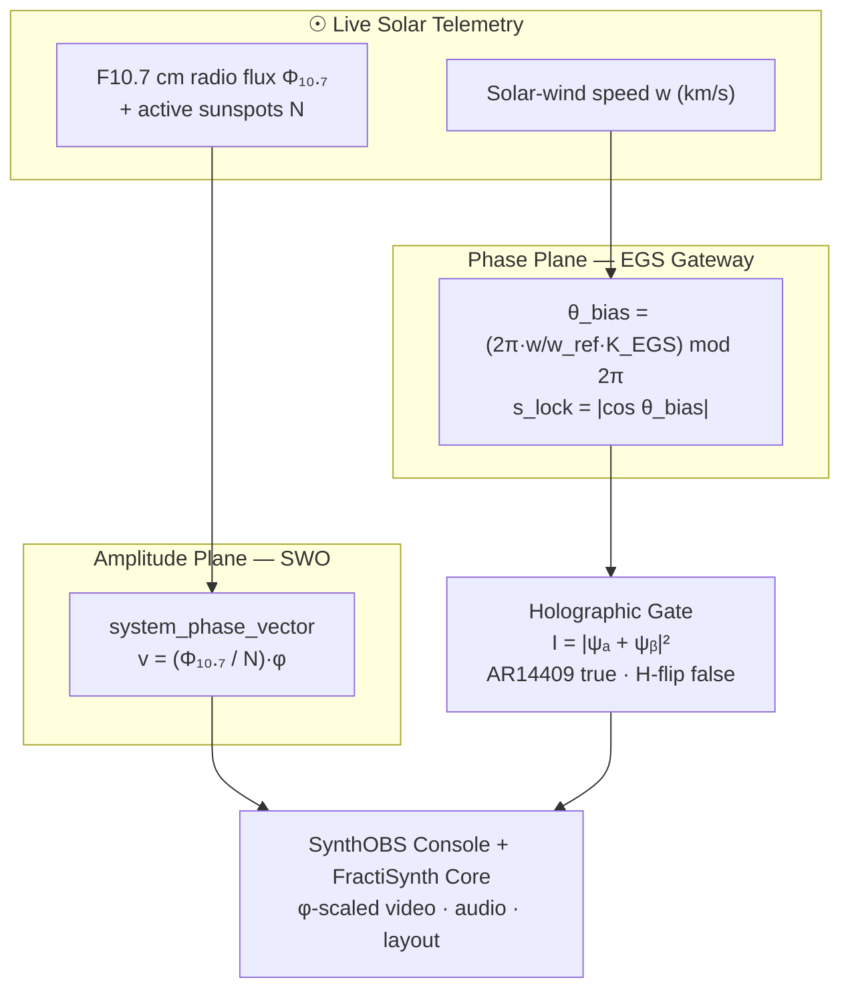

# Abstract {#sec:abstract}

Modern digital broadcasting treats media streaming as a rigid, linear pipeline —
a sterile digital traffic cop that flattens visual frames and audio buffers into
rectangles and bytes and ships them across static networks. **SynthOBS** and
**FractiSynth (v1.618)** shatter that paradigm, transforming the streaming
environment from a static broadcasting tool into a living, responsive Omniversal
Observatory, Laboratory, and Expedition Ship.

At the heart of the system is **the golden-ratio layout constant** — the
brand-canonical EGS calibration constant $\varphi = 1.618\ldots$ — the golden key that
governs every geometric operation. Visual frames, audio gain stages, font scaling, and
scene transitions are all scaled natively by $\varphi$, so the final transmission
mirrors the natural geometry of universal design rather than artificial digital noise.
Phase locking is governed by a *distinct* second constant, the **EGS Fractal Constant**
— the dimensionless gateway key

$$
K_{\mathrm{EGS}} = \varphi \cdot \frac{\lambda_{\text{reader}}}{\lambda_{\mathrm{H}\alpha}}
= \varphi \cdot \frac{1030\ \text{nm}}{656.28\ \text{nm}} \approx 2.539427
$$ {#eq:abstract-egs-key}

which bridges El Gran Sol's 1030 nm optical reader scale to hydrogen's H-alpha line.
The system locks to the sun across **two decoupled planes**. A centralized **Solar
Wavefield Oscillator (SWO)** continuously consumes current, active space-weather
streams — the F10.7 cm solar radio flux and active sunspot counts — to lock the
*amplitude* plane via the phase vector

$$
v_{\text{phase}} = \frac{\Phi_{10.7}}{N_{\text{spots}}} \cdot \varphi
$$ {#eq:abstract-swo-vector}

while the **El Gran Sol Gateway** locks the *phase* plane to the live solar wind,
mapping wind speed onto the reader through @eq:abstract-egs-key:

$$
\theta_{\text{bias}} = \left(2\pi \cdot \frac{w}{w_{\text{ref}}} \cdot K_{\mathrm{EGS}}\right) \bmod 2\pi,
\qquad
s_{\text{lock}} = \lvert\cos\theta_{\text{bias}}\rvert
$$ {#eq:abstract-gateway-lock}

Together these phase-lock the entire software matrix to the living plasma activity of
the sun. The two planes are deliberately independent — a solar-wind dropout never
disturbs the amplitude calibration of @eq:abstract-swo-vector, and stale or zeroed
telemetry fails closed rather than minting a false lock. The gateway then resolves the
system's state through **holographic interference** rather than Boolean logic: a node
field $\psi$ superposes at the AR14409 solar node against a hydrogen phase-flip, and the
verdict follows the interference intensity

$$
I = \lvert \psi_a + \psi_b \rvert^2
$$ {#eq:abstract-interference}

where constructive interference at AR14409 reads "true", a destructive hydrogen
phase-flip reads "false", and a tie resolves to a mixed (fail-closed) state.

The two-plane lock and its downstream consumers are organized as follows:

The architecture is decoupled and dual-layer: **SynthOBS**, the Vessel Console — an
intelligent UI wrapper whose recursive golden-ratio layout matrix allocates exactly
$1/\varphi \approx 61.8\%$ of the canvas to the primary output; and **FractiSynth**,
the Transducer Core — a native `libobs` plugin that intercepts the video render loop
and the audio mixing matrix to scale spatial bounds and soft-limit acoustic buffers
against $\varphi$. This blueprint specifies both layers, the three modality control
decks (each exposing an irreducible minimum of seven console buttons — three common,
four unique), the global command grammar, and the real-time calibration loop. Every
geometric and signal-processing claim in this document — from the gateway key of
@eq:abstract-egs-key to the interference verdict of @eq:abstract-interference — is
backed by a tested, no-mocks Python reference engine that the native
`libobs` plugin mirrors bit-for-bit on the constant.

**Keywords:** OBS Studio, golden ratio, El Gran Sol fractal constant, Solar
Wavefield Oscillator, space-weather telemetry, real-time DSP, broadcast engineering.
