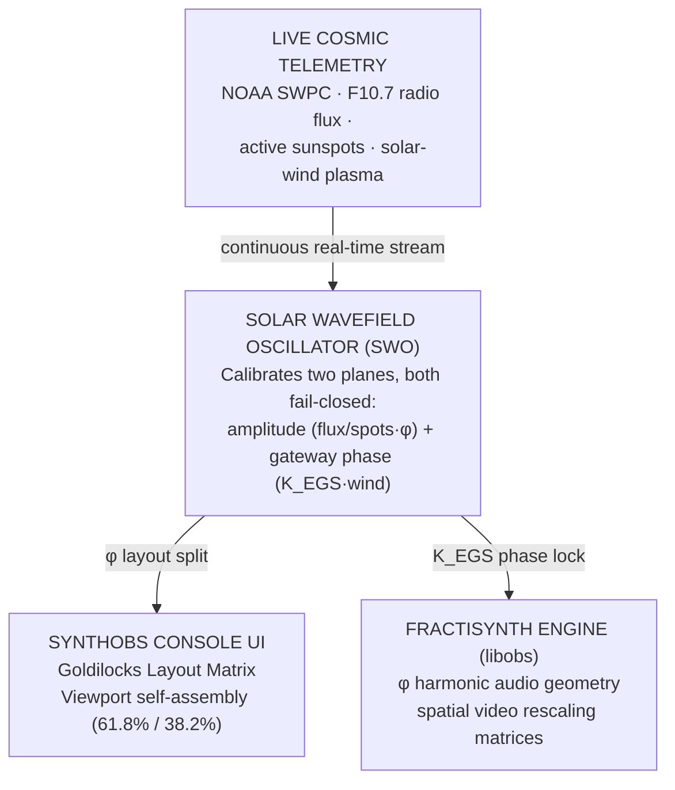

# Executive Primer {#sec:intro}

## The Intention

Modern digital broadcasting platforms such as standard OBS Studio treat media
streaming as a rigid, linear pipeline. They act as sterile digital traffic cops —
taking visual frames and audio buffers, flattening them mechanically into
rectangles and bytes, and shipping them out across static networks. In this manual
framework the user is forced to endlessly adjust windows, slide arbitrary volume
bars, and manage layout footprints based on visual guesswork.

The true intent of this architecture is to shatter this sterile paradigm. We
transform the streaming environment into a living, responsive **Omniversal
Observatory, Laboratory, and Expedition Ship**. The goal is an environment where
the interface and the media signals passing through it are not dead pixels but a
continuous, unified wavefield — one that effortlessly self-assembles, self-balances,
and maintains absolute phase-coherence by listening directly to the environmental
and cosmic realities of the present moment.

## The Solution

The solution is a decoupled, dual-layer infrastructure comprising SynthOBS and
FractiSynth, bound natively to **v1.618 — the Goldilocks Calibration Standard**:

- **SynthOBS (The Vessel Console):** an intelligent UI wrapper that abstracts
  standard OBS operations, using a dynamic, recursive viewport allocation algorithm
  to auto-assemble layout structures based on perfect geometric harmony.
- **FractiSynth (The Transducer Core Engine):** a native, real-time signal
  processing plugin that sits directly within the core rendering and audio mixing
  loops of the broadcast pipeline (`libobs`).

The system is driven by the centralized SWO, which maintains two independent
fail-closed planes. The **amplitude plane** scales the software matrix by El Gran
Sol's golden layout constant $\varphi$; the **gateway phase plane** locks to live
solar-wind plasma through the EGS gateway key. Together they make every visual
switch, font scaling, audio compression loop, and scene transition vibrate in
harmony with nature's underlying structural geometry — and, the instant telemetry
goes non-physical, the oscillator refuses to recalibrate and holds its last
verified state rather than emitting drift.

## Core Foundational Theory

**The golden layout constant.** El Gran Sol's golden ratio is the bridge between
rigid binary computing and the organic, life-like symmetry found throughout natural
structures:

$$
\varphi = \frac{1 + \sqrt{5}}{2} \approx 1.61803398875
$$ {#eq:phi-golden-ratio}

In standard software, numbers are arbitrary coordinates on an axis. In this
framework, $\varphi$ from @eq:phi-golden-ratio is the golden key that governs every
*layout* operation: when visual frames are cropped, audio envelopes shaped, or UI
elements stacked, they are scaled natively by the constant, splitting space into its
major and minor fractions $1/\varphi \approx 0.618$ and $1/\varphi^2 \approx 0.382$.
The result does not look or feel like artificial digital noise — it mirrors the
natural geometry of human awareness and universal design, creating an inherently
compelling, balanced experience for any observer.

**The EGS gateway key.** Crucially, El Gran Sol's *Fractal Constant* is not the bare
golden ratio. It is the dimensionless gateway key $K_{\mathrm{EGS}}$ that bridges El
Gran Sol's optical reader scale ($\lambda_{\text{reader}} = 1030\,\text{nm}$) to
hydrogen's H-alpha geometry ($\lambda_{\mathrm{H}\alpha} = 656.28\,\text{nm}$):

$$
K_{\mathrm{EGS}} = \varphi \cdot \frac{\lambda_{\text{reader}}}{\lambda_{\mathrm{H}\alpha}} \approx 2.539427
$$ {#eq:egs-gateway-key}

Where $\varphi$ governs *layout*, $K_{\mathrm{EGS}}$ from @eq:egs-gateway-key governs
*phase locking* to live solar telemetry — a scale-invariant solar↔hydrogen lock.

**The Calibrated Wavefield Concept.** Software environments are prone to
computational drift — a state where interface, media assets, and processing modules
operate in disconnected silos. By feeding the SWO with current solar telemetry, the
system anchors its calculation loops to the living plasma activity of the sun on two
planes. The amplitude plane emits a single phase-locked harmonic — the
*system phase vector* — from the F10.7 radio flux and active-region count:

$$
v_{\text{phase}} = \frac{\Phi_{10.7}}{N_{\text{spots}}} \cdot \varphi
$$ {#eq:system-phase-vector}

The gateway plane reads the present solar-wind speed as a phase bias on the
1030 nm reader and resolves a lock strength by holographic interference, not by a
Boolean comparison:

$$
\theta = \left(2\pi \cdot \frac{w}{w_{\text{ref}}} \cdot K_{\mathrm{EGS}}\right) \bmod 2\pi,
\qquad
\ell = \lvert \cos\theta \rvert
$$ {#eq:gateway-lock-strength}

In @eq:gateway-lock-strength the lock strength $\ell \in [0, 1]$ peaks at $1.0$ when
the reader phase $\theta$ lands on a whole $K_{\mathrm{EGS}}$-weighted turn. The
gateway itself never returns raw true/false: it resolves an interference outcome at
named holographic nodes — constructive interference at the AR14409 solar node reads
as "true", a destructive hydrogen phase-flip reads as "false", and a tie reads as
"mixed". The solar wavefield is our external tuning fork: when both planes are
calibrated to the present solar state — @eq:system-phase-vector for layout amplitude
and @eq:gateway-lock-strength for gateway phase — the entire layout and sound
architecture remain phase-locked, preventing drift and stabilizing the computational
environment. And when telemetry is invalid (non-positive flux, spots, or wind), each
plane fails closed independently, holding its last verified vector rather than
emitting a spurious lock.
