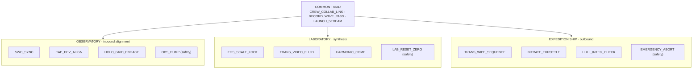

# The 3 Modality Control Matrices {#sec:modalities}

Each deck exposes seven hardwired buttons — three common (the operational overlap
with standard OBS) and four unique to the mode. The common triad —
`CREW_COLLAB_LINK`, `RECORD_WAVE_PASS`, `LAUNCH_STREAM` — is identical across all
three decks; the twelve unique buttons are disjoint. The console model is encoded
and structurally validated in the tested engine (`synthobs.console`).

## Observatory Mode — Inbound Alignment Matrix

*Mission focus: discovery, signal capture, sensor synchronization, anchoring the
inbound wavefield.*

| Button | Class | Function |
| --- | --- | --- |
| `CREW_COLLAB_LINK` | common | Inbound remote ingestion portal for external crew/observatory streams. |
| `RECORD_WAVE_PASS` | common | Commit raw wavefield data to local disk with $\varphi$-optimized sector allocation. |
| `LAUNCH_STREAM` | common | Establish the outbound handshake and broadcast the active observatory viewport. |
| `SWO_SYNC` | unique | Force an immediate clock calibration against current sunspot radio flux (e.g. AR4465). |
| `CAP_DEV_ALIGN` | unique | Cycle and test inbound capture hardware; align raw frames into harmonic bounding boxes. |
| `HOLO_GRID_ENGAGE` | unique | Overlay a golden-ratio alignment grid to guide spatial camera composition. |
| `OBS_DUMP` | unique (safety) | Purge all raw inbound buffer queues and temporary frames to clear signal latency. |

`SWO_SYNC` does not merely read a clock — it phase-locks the inbound wavefield to
the live Sun. The gateway injects the measured solar-wind speed as a phase bias on
the virtual 1030 nm reader, weighted by the EGS Fractal Constant
$K_{\mathrm{EGS}}$, then reports how strongly the system is in phase. This is the
gateway phase law (`synthobs.gateway.gateway_filter`):

$$
\phi_{\text{bias}} = \left(2\pi \cdot \frac{v_{\text{wind}}}{v_{\text{ref}}} \cdot K_{\mathrm{EGS}}\right) \bmod 2\pi,
\qquad
\ell = \lvert\cos\phi_{\text{bias}}\rvert
$$ {#eq:gateway-lock}

with reference wind $v_{\text{ref}} = 400\ \mathrm{km\,s^{-1}}$ and lock strength
$\ell \in [0,1]$ ($1$ a perfect lock, $0$ fully out of phase). The gateway key
itself anchors El Gran Sol's optical scale to the hydrogen line:

$$
K_{\mathrm{EGS}} = \varphi \cdot \frac{\lambda_{\text{reader}}}{\lambda_{\mathrm{H\alpha}}}
= \varphi \cdot \frac{1030}{656.28} \approx 2.539427
$$ {#eq:egs-key}

Equation @eq:gateway-lock fails closed: a non-positive wind reading never produces
a lock, so the deck holds its last good state rather than synchronizing to a
stale indicator. Note that $\varphi$ governs spatial *layout* throughout the
console, whereas $K_{\mathrm{EGS}}$ of @eq:egs-key governs *phase* locking to solar
telemetry — distinct constants for distinct planes.

## Laboratory Mode — Processing & Synthesis Engine

*Mission focus: deep signal modification, real-time audio/video transformation,
geometric harmonization.*

| Button | Class | Function |
| --- | --- | --- |
| `CREW_COLLAB_LINK` | common | Shared telemetry/session sync; remote collaborators pipe streams into the $\varphi$ transducer matrix. |
| `RECORD_WAVE_PASS` | common | Commit synthesized, transformed audio/video directly to local storage. |
| `LAUNCH_STREAM` | common | Deploy the ongoing laboratory signal synthesis to live networks. |
| `EGS_SCALE_LOCK` | unique | Enforce the EGS fractal constant across all gain stages and frame-crop variables. |
| `TRANS_VIDEO_FLUID` | unique | Convert static pixel blocks into a fluid, responsive wavefield texture. |
| `HARMONIC_COMP` | unique | Route audio through a recursive $1/\varphi$ soft-limiting compressor curve. |
| `LAB_RESET_ZERO` | unique (safety) | Snap all DSP values back to the baseline Goldilocks calibration standard. |

`EGS_SCALE_LOCK` pins every gain stage and frame-crop variable to the same gateway
key $K_{\mathrm{EGS}}$ of @eq:egs-key, so the synthesis plane scales in lockstep
with the inbound phase plane. `HARMONIC_COMP` then routes audio through a recursive
soft-limiter whose knee sits at the reciprocal golden ratio: gain above the
$1/\varphi$ threshold is folded back by the same ratio, so each successive overshoot
is attenuated geometrically.

$$
g(x) =
\begin{cases}
x, & \lvert x\rvert \le 1/\varphi \\[4pt]
\dfrac{1}{\varphi} + \dfrac{1}{\varphi}\bigl(\lvert x\rvert - 1/\varphi\bigr)\,\operatorname{sgn}(x), & \lvert x\rvert > 1/\varphi
\end{cases}
$$ {#eq:harmonic-comp}

The $1/\varphi$ knee of @eq:harmonic-comp is what keeps the compressor "harmonic":
the same constant that lays out the canvas also shapes the limiting curve.

## Expedition Ship Mode — Outbound Transmission Deck

*Mission focus: secure encoding, packet delivery, flight/stream-path monitoring,
planetary broadcasting.*

| Button | Class | Function |
| --- | --- | --- |
| `CREW_COLLAB_LINK` | common | Transform a standalone stream into a multi-vessel fleet broadcast. |
| `RECORD_WAVE_PASS` | common | Capture local master archival records of the entire outbound voyage. |
| `LAUNCH_STREAM` | common | Initiate the low-latency encoding engine to push the ship's transmission live. |
| `TRANS_WIPE_SEQUENCE` | unique | Scene cut via a fractal geometric wipe along an active $\varphi$ spiral trajectory. |
| `BITRATE_THROTTLE` | unique | Scale outbound encoding bitrate live to match network throughput without dropping frames. |
| `HULL_INTEG_CHECK` | unique | Real-time diagnostic scan: frame drops and rendering latency reported as "hull integrity". |
| `EMERGENCY_ABORT` | unique (safety) | Drop the outbound stream, clear network ports, set the canvas to an obsidian safe-state. |

The geometric wipe of `TRANS_WIPE_SEQUENCE` expands or collapses along an active
$\varphi$ spiral. The trajectory is generated by the tested
`golden_spiral_points()` function (`synthobs.layout`) — a logarithmic spiral whose
radius multiplies by exactly $\varphi$ every quarter-turn:

$$
r(\theta) = a \cdot \varphi^{\,2\theta/\pi}
$$ {#eq:golden-spiral}

The growth law of @eq:golden-spiral satisfies $r(\theta + \pi/2) = \varphi\,r(\theta)$,
so the wipe front advances by one golden step each quarter-turn — the same $\varphi$
that splits the canvas now drives the transition geometry (@fig:spiral).

{#fig:spiral width=60%}
