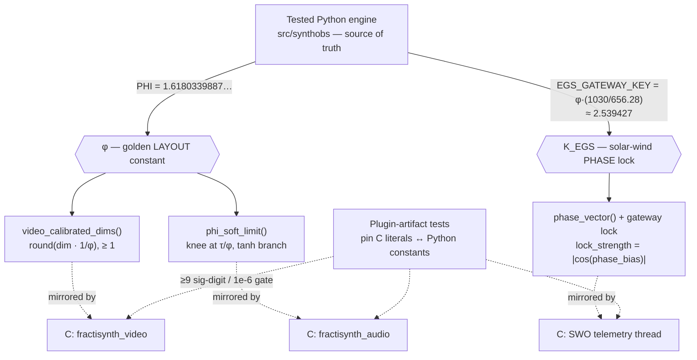

# FractiSynth Engine Specification (The Processing Core) {#sec:fractisynth}

FractiSynth is compiled as a native, low-latency plugin module that hooks into the
core processing pipelines of `libobs`. It exposes two filters — a video calibrator
and an audio harmonic limiter — both phase-locked to the EGS fractal constant and
the live Solar Wavefield Oscillator vector.

## Native Video Manipulation Pipeline

The plugin intercepts the video rendering loop at the texture level. Before frames
are handed off to the hardware encoder, FractiSynth forces spatial transformations
to scale directly against the EGS fractal constant $\varphi$, establishing the
*calibrated harmonic bounding box*:

$$
w_{\text{cal}} = \operatorname{round}\!\left( \frac{w_{\text{source}}}{\varphi} \right),
\qquad
h_{\text{cal}} = \operatorname{round}\!\left( \frac{h_{\text{source}}}{\varphi} \right),
\qquad w_{\text{cal}}, h_{\text{cal}} \ge 1 .
$$ {#eq:fractisynth-calibrated-box}

Equation @eq:fractisynth-calibrated-box scales each axis to $1/\varphi \approx 0.618$
of its source extent — the 61.8% golden fraction — clamped so a non-degenerate source
never collapses to zero extent. The live SWO `system_phase_vector` then modulates the
shader displacement amount, so the overlay breathes with current space weather. The
native filter implements the full `libobs` lifecycle — `create / destroy / update /
get_properties / get_defaults / video_render / get_width / get_height` — and its
calibration is the tested Python `video_calibrated_dims()` taken as the source of truth.

## Native Audio Harmonic Balancing

Audio sample frames passing through the internal DSP matrix are intercepted via the
`filter_audio` callback. Instead of harsh linear peak limiting that clips
frequencies, the buffers are compressed along a smooth recursive curve scaled by
$\varphi$. Below a knee at $1/\varphi$ of the ceiling the signal passes through
untouched; above it, the excess is soft-compressed so the output asymptotically
approaches — but never exceeds — the ceiling:

$$
y(x) =
\begin{cases}
x, & \lvert x \rvert \le \tau/\varphi \\
\operatorname{sign}(x)\left[\dfrac{\tau}{\varphi} + h\,\tanh\!\left(\dfrac{\lvert x \rvert - \tau/\varphi}{h\,\varphi}\right)\right], & \lvert x \rvert > \tau/\varphi
\end{cases}
$$ {#eq:fractisynth-phi-limiter}

where $\tau$ is the ceiling and $h = \tau(1 - 1/\varphi) = \tau/\varphi^{2}$ is the
headroom. The knee of @eq:fractisynth-phi-limiter sits at $\tau/\varphi$, so the
identity region spans exactly the golden $1/\varphi$ fraction of the ceiling; the
$\tanh$ branch is bounded by $h$, guaranteeing $\lvert y \rvert$ approaches but never
crosses $\tau$. The curve is monotone, sign-preserving, and NaN/Inf-safe — maximizing
acoustic presence while preventing compression fatigue (@fig:limiter).

{#fig:limiter width=70%}

## Single Source of Truth

Two implementations carry the same calibration: the native C plugin
(`#define EGS_PHI 1.61803398875f`, `#define EGS_GATEWAY_KEY 2.53942700f`) and the
tested Python engine (`synthobs.constants.PHI`, `synthobs.constants.EGS_GATEWAY_KEY`).
Project tests pin both literals against their floating-point counterparts — $\varphi$
to at least nine significant digits and $K_{\text{EGS}}$ to better than $10^{-6}$ — so
the native transducer and the reference engine cannot drift apart silently.

The two paths converge by contract: every formula — the video scaling of
@eq:fractisynth-calibrated-box, the audio knee of @eq:fractisynth-phi-limiter, and the
SWO phase vector — is derived once in Python and mirrored field-for-field in C, with
the literal-pinning gate standing guard against silent divergence.
