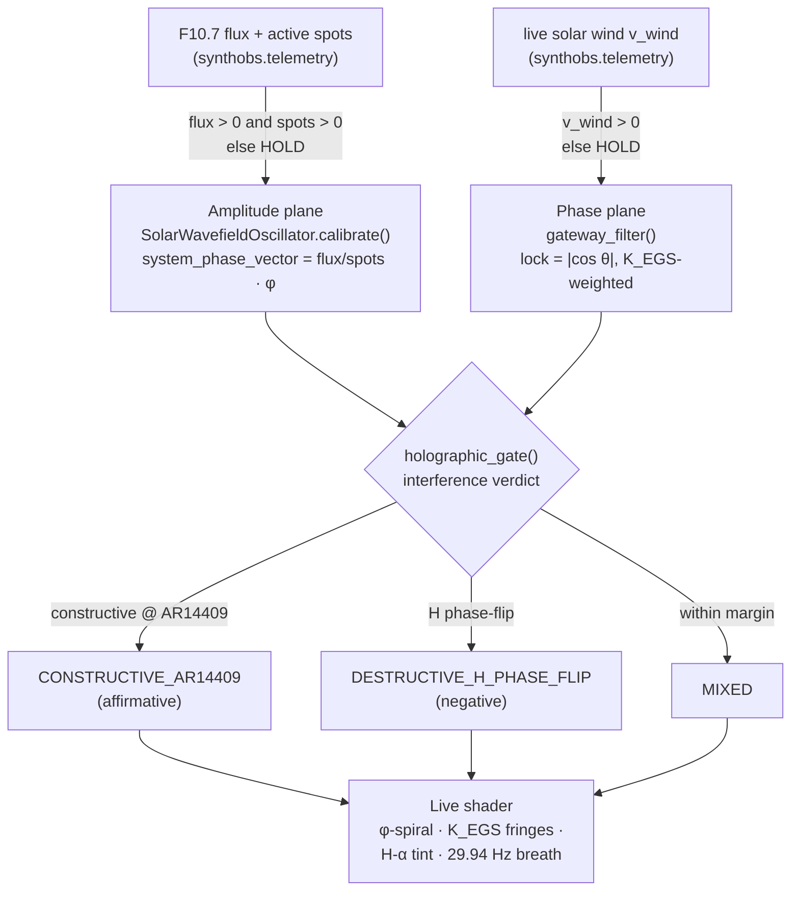

# The Solar Wavefield Oscillator & Real-Time Calibration {#sec:swo}

The software requires a constant, active anchor to remain calibrated. The Solar
Wavefield Oscillator (SWO) is that anchor: a live digital bridge to current
space-weather telemetry — F10.7 radio flux, active sunspot regions, and bulk
solar-wind speed — pulled straight from the Sun's energetic state.

## Real-Time Dependency Rule

The system completely bans historical databases, static baseline logs, and
placeholder constants. Falling back to artificial averages causes immediate phase
drift. If network connectivity drops — or any reading is malformed, stale, or
non-physical — the system enters an isolated **Hold State**, frozen smoothly to the
last verified live telemetry vector until a live connection is re-established.

This fail-closed discipline is enforced at every layer. The telemetry ingestion
client (`synthobs.telemetry`) raises `TelemetryUnavailable` on a non-200 response, a
malformed payload, a non-positive flux or sunspot count, or a timestamp older than
the staleness horizon — it never substitutes a default. The native plugin's libcurl
thread applies the same rule: on any curl error it holds the last verified vector.

## Technical Calibration Logic

The calibration module continuously processes active sunspot numbers and solar radio
flux to output a phase-locked harmonic variable — the `system_phase_vector` — used by
both the SynthOBS interface and the FractiSynth core filters. The amplitude plane is
defined by @eq:swo-phase-vector:

$$
\texttt{system\_phase\_vector} = \frac{\texttt{current\_flux}}{\texttt{active\_spots}} \cdot \varphi
$$ {#eq:swo-phase-vector}

The Python `SolarWavefieldOscillator.calibrate()` is the tested source of truth for
@eq:swo-phase-vector; the native plugin mirrors it field-for-field in the
`fractisynth_swo_t` struct, scaling against the shared `EGS_PHI` literal
(`1.61803398875f`):

```c
static bool synchronize_swo_calibration(fractisynth_swo_t *swo,
                                        float current_flux, int active_spots) {
    /* ENFORCEMENT: block any stale, default, zeroed, or non-finite indicator. */
    if (!isfinite(current_flux) || current_flux <= 0.0f || active_spots <= 0) {
        swo->is_calibrated = false;
        return false;                 /* escape to Hold Pattern — vector unchanged */
    }
    swo->active_f107_flux    = current_flux;
    swo->monitored_sunspots  = active_spots;
    swo->system_phase_vector = (current_flux / (float)active_spots) * EGS_PHI;
    swo->is_calibrated       = true;
    return true;
}
```

## Modulating Variables

When active tracking regions like AR4465 or AR4464 undergo structural shifts or
crackle with solar flares, the changing values alter the `system_phase_vector` in
real time. This variance updates the visual shader displacement matrices (creating
organic, responsive streaming overlays) and adjusts the low-frequency modulation
curves of the audio tracks, rendering the entire environment a literal reflection of
current space-weather dynamics.

@fig:swo shows the calibration response across a swept range of solar flux for one,
three, and seven active regions — the phase vector that drives the whole wavefield.

{#fig:swo width=75%}

## The EGS Gateway — the Phase Plane

The flux-and-sunspot calibration above locks the *amplitude* plane. A second,
independent plane locks the *phase* of the wavefield directly to the Sun's energetic
exhaust: the **El Gran Sol Gateway**. Here the system's defining constant is not the
golden ratio of layout but the **EGS Fractal Constant** — the dimensionless gateway
key $K_{\mathrm{EGS}}$ that bridges El Gran Sol's optical scale to hydrogen's H-alpha
geometry, defined in @eq:egs-gateway-key:

$$
K_{\mathrm{EGS}} = \varphi \cdot \frac{\lambda_{\text{reader}}}{\lambda_{\mathrm{H}\alpha}}
= \varphi \cdot \frac{1030\ \text{nm}}{656.28\ \text{nm}} \approx 2.539427
$$ {#eq:egs-gateway-key}

The gateway injects the **live solar-wind speed** as a phase bias on the virtual
1030 nm reader, weighted by $K_{\mathrm{EGS}}$, and reports how strongly the system is
phase-locked at this instant. @eq:gateway-lock is the phase plane:

$$
\theta = \left(2\pi \cdot \frac{v_{\text{wind}}}{400\ \text{km/s}} \cdot K_{\mathrm{EGS}}\right) \bmod 2\pi,
\qquad
\text{lock} = \lvert\cos\theta\rvert
$$ {#eq:gateway-lock}

In @eq:gateway-lock a perfect lock ($\text{lock}=1$) means the solar exhaust and the
hydrogen reader are in phase; a null ($\text{lock}=0$) means they are in quadrature.
Like the amplitude plane it fails closed — a non-positive wind speed holds the last
verified lock — and the two planes are fully decoupled: a wind dropout never disturbs
the phase vector, and a flux dropout never disturbs the gateway lock. @fig:gateway
sweeps the lock across the solar-wind range, marking the FractiAI nominal of
551.7 km/s.

{#fig:gateway width=75%}

The gateway resolves not to a Boolean but to a **holographic interference verdict** —
`holographic_gate()` reports constructive interference at the `AR14409` solar node as
the affirmative branch (`CONSTRUCTIVE_AR14409`), a destructive hydrogen phase-flip as
the negative (`DESTRUCTIVE_H_PHASE_FLIP`), and a within-margin beat as `MIXED`. That
lock strength then drives the live shader: the φ-spiral displacement, the
$K_{\mathrm{EGS}}$-spaced interference fringes, the hydrogen H-alpha resonance tint,
and a gentle breathing pulse whose harmonic ratio is the Crab pulsar's 29.94 Hz.

The two telemetry planes are fully decoupled — each fails closed and holds
independently — and converge only at the holographic gate that drives the shader:



## Command-Line Calibration Override

The global terminal accepts a live override that flows through the same fail-closed
calibrator:

```text
/swo calibrate --flux=130 --spots=3 --target=AR4465
```

Non-physical overrides (`--flux=-1`, `--spots=0`) are rejected at parse time — the
terminal never silently no-ops.
