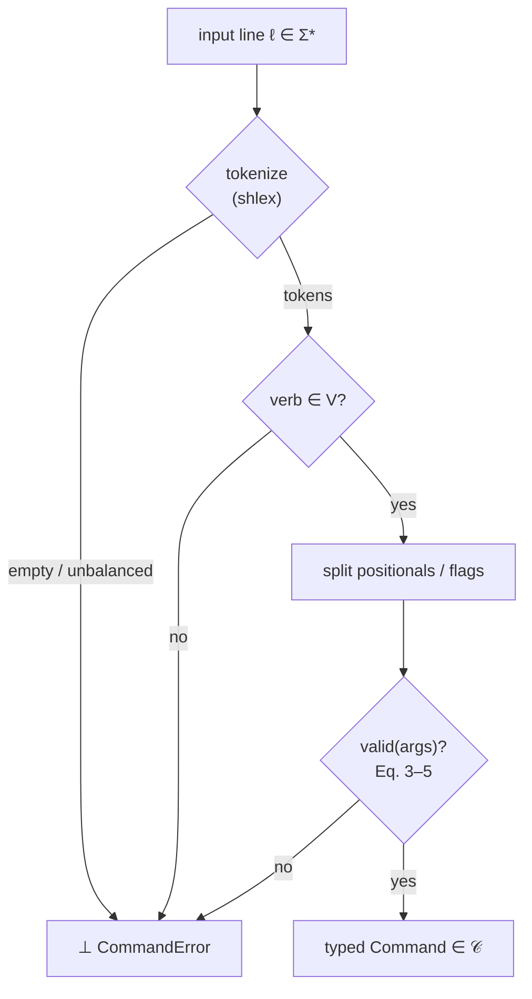

# Command Line Grammar Structure {#sec:grammar}

A persistent terminal line is mounted at the base of the Vessel Console and holds
active focus at all times. At any instant the operator can bypass the button decks
entirely and speak directly to the wavefield through clean, deterministic syntax —
the same channel whether the system is in Observatory, Laboratory, or Expedition
trim. The grammar is implemented by the tested `synthobs.commands` parser, which
returns a typed, frozen command object and fails closed on any unknown verb or
out-of-range value. Nothing in this layer is interpreted as a "best guess": a line
either resolves to one exact intent or it resolves to nothing at all.

Formally, the parser is the total map

$$
\mathrm{parse} : \Sigma^{*} \longrightarrow \mathcal{C} \;\uplus\; \{\,\bot\,\},
$$ {#eq:command_grammar-1}

where $\Sigma^{*}$ is the set of all input lines, $\mathcal{C}$ is the closed set of
typed commands $\{\textsf{ModeCommand}, \textsf{BindCommand}, \textsf{CalibrateCommand}\}$,
and $\bot$ is the fail-closed outcome — raised in code as `CommandError`. There is no
fourth branch. Equation @eq:command_grammar-1 is the safety spine of the console: the
image of every line is either a fully-validated command or an explicit refusal, never
a silent no-op.

The fail-closed branch is reached precisely when the line is empty, the verb is
unknown, or any argument falls outside its admissible range:

$$
\mathrm{parse}(\ell) = \bot
\iff
\ell = \varepsilon
\;\lor\;
v(\ell) \notin V
\;\lor\;
\lnot\,\mathrm{valid}\bigl(\mathrm{args}(\ell)\bigr),
$$ {#eq:command_grammar-2}

with $\varepsilon$ the empty line, $v(\ell)$ the leading verb, and
$V = \{\,\texttt{/mode},\ \texttt{/transducer},\ \texttt{/swo}\,\}$ the registered
verb set. Equation @eq:command_grammar-2 is enforced verb-by-verb below.

## Mode Switching Macros

```text
/mode --observatory
/mode --lab
/mode --ship
```

Each macro resolves to exactly one of the three valid decks. Writing $M$ for the
deck set, the resolution is a lookup into the fixed flag table:

$$
\mathrm{mode}(\ell) =
\begin{cases}
\textsf{OBSERVATORY} & \text{if flag} \in \{\,\texttt{-{}-observatory}\,\},\\
\textsf{LABORATORY}  & \text{if flag} \in \{\,\texttt{-{}-lab},\ \texttt{-{}-laboratory}\,\},\\
\textsf{EXPEDITION}  & \text{if flag} \in \{\,\texttt{-{}-ship},\ \texttt{-{}-expedition}\,\},\\
\bot & \text{otherwise.}
\end{cases}
$$ {#eq:command_grammar-3}

An unrecognized target falls to the $\bot$ branch of @eq:command_grammar-3 and raises
a command error rather than leaving the console in an ambiguous trim. The aliases
(`--lab`/`--laboratory`, `--ship`/`--expedition`) are accepted so spoken shorthand
and full names land on the same deck.

## Dynamic Filter Routing via the EGS Fractal Constant

```text
/transducer bind source_cam_01 --ratio=1.618034
```

Binds a named source into the transducer matrix at the requested golden ratio. The
default operating point is $\varphi = 1.6180339887\ldots$ — El Gran Sol's Fractal
Constant for *layout* — but the operator may dial any strictly positive ratio. The
bind is admitted only when both the source name and a positive ratio are present:

$$
\mathrm{valid}_{\text{bind}}
\iff
(\,\text{positional}_0 = \texttt{bind}\,)
\;\land\;
(\,\text{source} \neq \varepsilon\,)
\;\land\;
(\,r > 0\,),
\qquad r \in \mathbb{R}.
$$ {#eq:command_grammar-4}

A missing source, a non-numeric ratio, or any $r \le 0$ violates
@eq:command_grammar-4 and routes to $\bot$ — the matrix never binds against a
degenerate or sign-flipped scale.

## Live Telemetry Overrides

```text
/swo calibrate --flux=130 --spots=3 --target=AR4465
```

Forces a manual Solar Wavefield Oscillator calibration, injecting an operator-chosen
F10.7 flux and active-region count in place of the live feed. Numeric flags
round-trip to their declared types — float `flux`, integer `spots` — and the
non-physical region of telemetry space is rejected outright:

$$
\mathrm{valid}_{\text{calibrate}}
\iff
(\,\text{flux} > 0\,)
\;\land\;
(\,\text{spots} > 0\,),
\qquad
\text{flux} \in \mathbb{R},\ \text{spots} \in \mathbb{Z}.
$$ {#eq:command_grammar-5}

The constraint in @eq:command_grammar-5 is the same Hold State the oscillator applies
to its live feed: a zeroed or negative reading never produces a phase vector. The
admitted `(flux, spots)` pair flows into the `system_phase_vector` law of the SWO
plane (Chapter 5), and from there the live solar wind drives the EGS Gateway phase
lock $\lvert\cos(\text{phase\_bias})\rvert$ governed by the gateway key
$K_{\mathrm{EGS}} = \varphi \cdot (\lambda_{\text{reader}}/\lambda_{H\alpha}) \approx 2.539427$.
The terminal therefore cannot inject a calibration that the wavefield could not have
locked to on its own — fail-closed all the way down.

## The Parse Pipeline

Every line walks the same deterministic path: tokenize, dispatch on the verb,
partition flags, validate, and either emit a typed command or refuse. The stages map
one-to-one onto @eq:command_grammar-1 and @eq:command_grammar-2.

```text
  input line  ℓ ∈ Σ*
       │
       ▼
  ┌─────────────┐   empty / unbalanced quotes
  │  tokenize   │ ─────────────────────────────► ⊥  CommandError
  │  (shlex)    │
  └─────┬───────┘
        │ tokens = [verb, rest…]
        ▼
  ┌─────────────┐   verb ∉ V = {/mode,/transducer,/swo}
  │  dispatch   │ ─────────────────────────────► ⊥  CommandError
  │  on verb    │
  └─────┬───────┘
        │ positionals, --key=value flags
        ▼
  ┌─────────────┐   valid(args) is false  (Eq. 3–5)
  │  validate   │ ─────────────────────────────► ⊥  CommandError
  │  per verb   │
  └─────┬───────┘
        │ all constraints hold
        ▼
  ┌─────────────────────────────────────────┐
  │  typed Command  ∈ 𝒞                      │
  │  ModeCommand │ BindCommand │ CalibrateCommand │
  └─────────────────────────────────────────┘
```

The same flow as a control graph, making the single $\bot$ sink explicit:



## Grammar Summary

| Verb | Form | Result type | Admission rule |
| --- | --- | --- | --- |
| `/mode` | `--observatory \| --lab \| --ship` | `ModeCommand` | @eq:command_grammar-3 |
| `/transducer` | `bind <source> --ratio=<float>` | `BindCommand` | @eq:command_grammar-4 |
| `/swo` | `calibrate --flux=<float> --spots=<int> [--target=<id>]` | `CalibrateCommand` | @eq:command_grammar-5 |

Any other verb, a missing required argument, or an out-of-range value lands on the
$\bot$ branch of @eq:command_grammar-2 and raises `CommandError`. The persistent
command line therefore can never fail silently — a core safety property of the Vessel
Console, holographically continuous with the fail-closed gateway and oscillator
planes beneath it.
