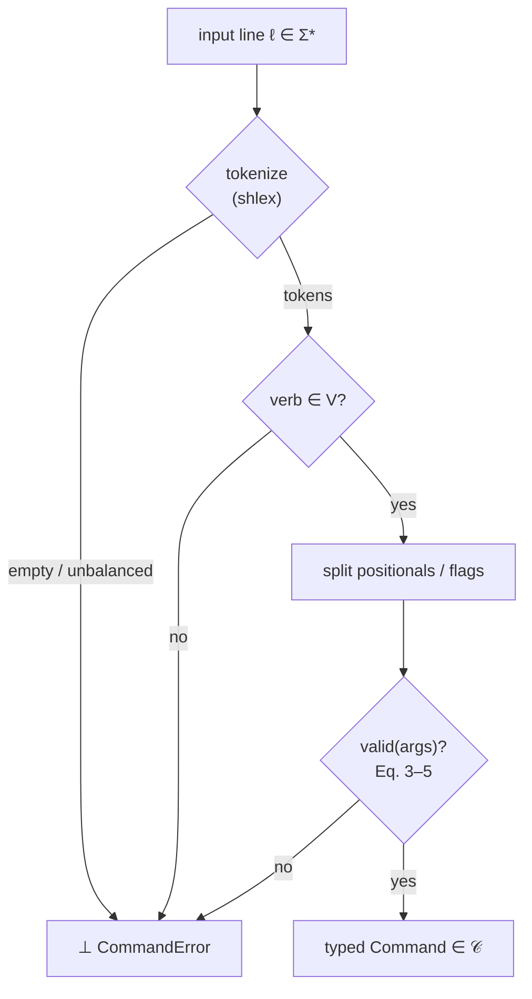

# Command Grammar: Telemetry, Parse Pipeline, and Summary {#sec:grammar-telemetry-parse-summary}

## Live Telemetry Overrides

```text
/swo calibrate --flux=130 --spots=3 --target=AR4465
```

Forces a manual Solar Wavefield Oscillator calibration, injecting an operator-chosen
F10.7 flux and active-region count in place of the live feed. Numeric flags
round-trip to their declared types — float `flux`, integer `spots` — and the
non-physical region of telemetry space is rejected outright:

$$
\mathrm{valid}_{\text{calibrate}}
\iff
(\,\text{flux} > 0\,)
\;\land\;
(\,\text{spots} > 0\,),
\qquad
\text{flux} \in \mathbb{R},\ \text{spots} \in \mathbb{Z}.
$$ {#eq:command_grammar-5}

The constraint in @eq:command_grammar-5 is the same Hold State the oscillator applies
to its live feed: a zeroed or negative reading never produces a phase vector. The
admitted `(flux, spots)` pair flows into the `system_phase_vector` law of the SWO
plane (Chapter 5), and from there the live solar wind drives the EGS Gateway phase
lock $\lvert\cos(\text{phase\_bias})\rvert$ governed by the gateway key
$K_{\mathrm{EGS}} = \varphi \cdot (\lambda_{\text{reader}}/\lambda_{H\alpha}) \approx 2.539427$.
The terminal therefore cannot inject a calibration that the wavefield could not have
locked to on its own — fail-closed all the way down.

## The Parse Pipeline

Every line walks the same deterministic path: tokenize, dispatch on the verb,
partition flags, validate, and either emit a typed command or refuse. The stages map
one-to-one onto @eq:command_grammar-1 and @eq:command_grammar-2.

```text
  input line  ℓ ∈ Σ*
       │
       ▼
  ┌─────────────┐   empty / unbalanced quotes
  │  tokenize   │ ─────────────────────────────► ⊥  CommandError
  │  (shlex)    │
  └─────┬───────┘
        │ tokens = [verb, rest…]
        ▼
  ┌─────────────┐   verb ∉ V = {/mode,/transducer,/swo}
  │  dispatch   │ ─────────────────────────────► ⊥  CommandError
  │  on verb    │
  └─────┬───────┘
        │ positionals, --key=value flags
        ▼
  ┌─────────────┐   valid(args) is false  (Eq. 3–5)
  │  validate   │ ─────────────────────────────► ⊥  CommandError
  │  per verb   │
  └─────┬───────┘
        │ all constraints hold
        ▼
  ┌─────────────────────────────────────────┐
  │  typed Command  ∈ 𝒞                      │
  │  ModeCommand │ BindCommand │ CalibrateCommand │
  └─────────────────────────────────────────┘
```

The same flow as a control graph, making the single $\bot$ sink explicit:



## Grammar Summary

| Verb | Form | Result type | Admission rule |
| --- | --- | --- | --- |
| `/mode` | `--observatory \| --lab \| --ship` | `ModeCommand` | @eq:command_grammar-3 |
| `/transducer` | `bind <source> --ratio=<float>` | `BindCommand` | @eq:command_grammar-4 |
| `/swo` | `calibrate --flux=<float> --spots=<int> [--target=<id>]` | `CalibrateCommand` | @eq:command_grammar-5 |

Any other verb, a missing required argument, or an out-of-range value lands on the
$\bot$ branch of @eq:command_grammar-2 and raises `CommandError`. The persistent
command line therefore can never fail silently — a core safety property of the Vessel
Console, holographically continuous with the fail-closed gateway and oscillator
planes beneath it.
