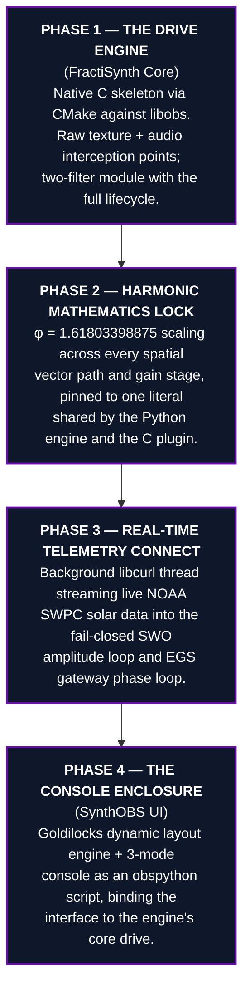

# Implementation Blueprint for v1.618 {#sec:implementation}

The system is realized as a tested Python reference engine — the single source of
truth — and a native `libobs` plugin that mirrors it bit-for-bit, assembled in four
phases. Each phase is a transmission gate: nothing downstream locks until the gate
above it has resolved.



## Repository Layout

| Path | Role |
| --- | --- |
| `src/synthobs/` | Tested Python engine — constants, layout, telemetry, SWO, DSP, console, commands, engine. The verified source of truth. |
| `plugin/fractisynth/` | Native `libobs` C plugin — two filters, shared SWO, libcurl telemetry thread, CMake build. |
| `plugin/synthobs/` | `obspython` console script — Goldilocks layout + 3-mode console + command line, driving the engine inside OBS. |
| `scripts/` | Thin orchestrators (figure generation) importing the engine. |
| `manuscript/` | This Technical Design Blueprint. |
| `tests/` | Zero-mock test suite, ≥ 90% coverage on `src/`. |

## Calibration Laws Pinned Across Both Implementations

Three formalisms cross the language boundary unchanged. Each is defined once in the
Python engine and re-stated as the identical arithmetic in the native `libobs` C
plugin; the shared literals in `src/synthobs/constants.py` (`PHI_C_LITERAL`,
`EGS_GATEWAY_KEY_C_LITERAL`) make any drift between the two a test failure.

**Phase 2 — amplitude plane.** The Solar Wavefield Oscillator collapses live F10.7
flux and the active-region count into a single phase-locked harmonic variable, the
`system_phase_vector`, scaled by the golden key φ (`swo.phase_vector`):

$$
v_{\text{phase}} = \frac{\Phi_{F10.7}}{N_{\text{spots}}}\,\varphi
$$ {#eq:swo-phase-vector}

**Phase 3 — phase plane.** The EGS gateway translates the Sun's energetic state into
a phase bias on the virtual 1030 nm reader, weighted by the EGS Fractal Constant /
gateway key $K_{\text{EGS}} = \varphi\,(\lambda_{\text{reader}}/\lambda_{H\alpha}) \approx 2.539427$.
The bias wraps onto the circle and the gateway reports how strongly the system is
phase-locked right now (`gateway.gateway_filter`):

$$
\theta_{\text{bias}} = \left(2\pi\,\frac{w}{w_{\text{ref}}}\,K_{\text{EGS}}\right) \bmod 2\pi,
\qquad
L = \lvert\cos\theta_{\text{bias}}\rvert
$$ {#eq:gateway-lock}

The lock strength $L \in [0,1]$ of @eq:gateway-lock resolves holographically, not as
a Boolean: constructive interference at the AR14409 node reads "true", a destructive
hydrogen phase-flip reads "false", and a tie reads "mixed". Both @eq:swo-phase-vector
and @eq:gateway-lock fail closed — a non-physical input ($\Phi_{F10.7} \le 0$,
$N_{\text{spots}} \le 0$, or $w \le 0$) never produces a lock; the engine holds its
last verified value rather than substituting an average or a zero.

**Phase 2 — gain stage.** Before audio reaches the encoder, the φ soft-limiter shapes
each excess sample so its magnitude approaches but never crosses the headroom ceiling
($1/\varphi$ knee, `dsp.phi_soft_limit_sample`):

$$
y = \operatorname{sgn}(x)\left(k + h\cdot\tanh\frac{e}{h\,\varphi}\right),
\quad k = \frac{\tau}{\varphi},
\quad h = \tau - k = \frac{\tau}{\varphi^{2}},
\quad e = \lvert x\rvert - k
$$ {#eq:phi-soft-limit}

where $\tau$ is the threshold, $k$ the $1/\varphi$ knee below which samples pass
through unchanged, and $e$ the excess above it. The $\tanh$ shaping of
@eq:phi-soft-limit guarantees a monotone, sign-preserving transfer curve whose
magnitude approaches but never reaches $\tau$.

## Build, Test, Install

```bash
# Test the reference engine (zero mocks; pytest-httpserver for live HTTP)
uv run pytest projects/working/SynthOBS/tests/ \
  --cov=synthobs --cov-fail-under=90

# Regenerate the figures in this document
uv run python projects/working/SynthOBS/scripts/generate_figures.py

# Build the native FractiSynth plugin (requires libobs dev headers + libcurl)
cd plugin/fractisynth && cmake -B build -DCMAKE_BUILD_TYPE=Release && cmake --build build

# Install: drop the built module into your OBS plugins directory, and load
# plugin/synthobs/synthobs_console.py via OBS → Tools → Scripts.
```

## Verification Status

Every geometric, telemetry, and DSP claim in this blueprint is exercised by the
zero-mock test suite over the reference engine — including the three pinned laws
@eq:swo-phase-vector, @eq:gateway-lock, and @eq:phi-soft-limit and their fail-closed
boundaries. The native C plugin is authored to `obs-studio` plugin conventions and
shares the φ literal, the SWO and gateway formulas, and the fail-closed rule with the
engine; its on-target compilation against `libobs` is a documented follow-up
(`SYNTHOBS-CBUILD-1`), since a `libobs` toolchain is required to build it. The Python
engine therefore remains authoritative: the C plugin mirrors arithmetic the engine
has already proven, never the reverse.

*A fair-exchange clause is in effect for this architectural expansion. Adjustments,
refinements, or partial revisions to the delivery scale can be handled through
subsequent collaborative feedback.*
