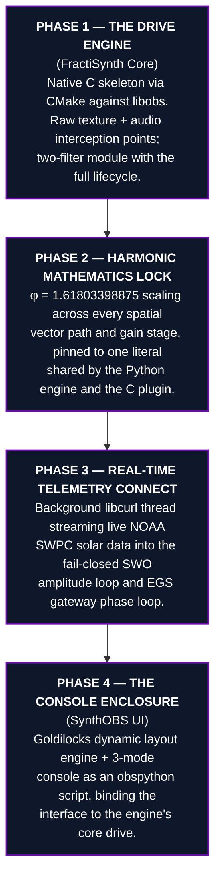

# Implementation Blueprint for v1.618 {#sec:implementation}

The system is realized as a tested Python reference engine—the portable source of
truth—and a native `libobs` plugin that implements the OBS-bound counterparts,
assembled in four phases. Each phase is a transmission gate: downstream behavior
is admitted only after the relevant contract has resolved.

The implementation and evidence protocol follows reproducible-computing practice:
the source tree, tool versions, deterministic figure generator, test command, and
live-capture manifest are all named so a reader can distinguish rerunning the same
computation from re-establishing the external OBS/NOAA environment
[@nasem2019; @wilson2014; @sandve2013; @wilkinson2016fair]. The OBS module and websocket boundaries are
documented against their primary interfaces [@obsmodules; @obswebsocket].


<!-- alt: Four implementation phases: native libobs lifecycle, shared phi mathematics, live NOAA telemetry admission, and the SynthOBS console enclosure converge into the complete instrument. -->

## Repository Layout

| Path | Role |
| --- | --- |
| `src/synthobs/` | Tested Python engine — constants, layout, telemetry, SWO, DSP, console, commands, interaction targets, dashboard layers, engine. The verified source of truth. |
| `plugin/fractisynth/` | Native `libobs` C plugin — filters, draggable console source, dock, shared SWO, libcurl telemetry thread, CMake build. |
| `plugin/synthobs/` | `obspython` console script — Goldilocks layout + 3-mode console + command line + dashboard helper, driving the engine inside OBS. |
| `scripts/` | Thin orchestrators (figure generation) importing the engine. |
| `manuscript/` | This Technical Design Blueprint. |
| `tests/` | Real-input test suite, ≥ 90% coverage on `src/`. |

## Calibration Laws Pinned Across Both Implementations

Three formalisms cross the language boundary as declared contracts. Each is defined
in the Python engine and implemented at the native `libobs` boundary; the shared
literals in `src/synthobs/constants.py` (`PHI_C_LITERAL`,
`EGS_GATEWAY_KEY_C_LITERAL`) plus static and behavioral checks make material drift
between the two visible.

**Phase 2 — amplitude plane.** The Solar Wavefield Oscillator maps admitted F10.7
flux and active-region count to the bounded `system_phase_vector`, scaled by the
golden key φ (`swo.phase_vector`):

$$
v_{\text{phase}} = \frac{\Phi_{F10.7}}{N_{\text{spots}}}\,\varphi
$$ {#eq:implementation-swo-phase-vector}

**Phase 3 — phase plane.** The EGS gateway translates the Sun's energetic state into
a phase bias on the virtual 1030 nm reader, weighted by the EGS Fractal Constant /
gateway key $K_{\text{EGS}} = \varphi\,(\lambda_{\text{reader}}/\lambda_{\text{H-alpha}}) \approx 2.539427$.
The bias wraps onto the circle and the gateway reports the current model score
(`gateway.gateway_filter`):

$$
\theta_{\text{bias}} = \left(2\pi\,\frac{w}{w_{\text{ref}}}\,K_{\text{EGS}}\right) \bmod 2\pi,
\qquad
L = \lvert\cos\theta_{\text{bias}}\rvert
$$ {#eq:implementation-gateway-lock}

The lock strength $L \in [0,1]$ of @eq:implementation-gateway-lock resolves holographically, not as
a Boolean: constructive interference at the AR14409 node reads "true", a destructive
hydrogen phase-flip reads "false", and a tie reads "mixed". Both @eq:implementation-swo-phase-vector
and @eq:implementation-gateway-lock fail closed — a non-physical input ($\Phi_{F10.7} \le 0$,
$N_{\text{spots}} \le 0$, or $w \le 0$) never produces a lock; the engine holds its
last verified value rather than substituting an average or a zero.

**Phase 2 — gain stage.** Before audio reaches the encoder, the φ soft-limiter shapes
each excess sample so its magnitude approaches but never crosses the headroom ceiling
($1/\varphi$ knee, `dsp.phi_soft_limit_sample`):

$$
y = \operatorname{sgn}(x)\left(k + h\cdot\tanh\frac{e}{h\,\varphi}\right),
\quad k = \frac{\tau}{\varphi},
\quad h = \tau - k = \frac{\tau}{\varphi^{2}},
\quad e = \lvert x\rvert - k
$$ {#eq:phi-soft-limit}

where $\tau$ is the threshold, $k$ the $1/\varphi$ knee below which samples pass
through unchanged, and $e$ the excess above it. The $\tanh$ shaping of
@eq:phi-soft-limit guarantees a monotone, sign-preserving transfer curve whose
magnitude approaches but never reaches $\tau$.

## Build, Test, Install

```bash
# Test the reference engine (pytest-httpserver provides real local HTTP)
uv run python -m pytest tests/ \
  --cov=synthobs --cov-fail-under=90

# Regenerate the figures in this document
uv run python scripts/generate_figures.py

# Build the native FractiSynth plugin (requires libobs dev headers + libcurl)
plugin/fractisynth/build.sh

# OBS script commands include:
# /dashboard plan --name=Awareness
# /dashboard build --name=Awareness
```

## Verification Status

Every executable geometric, telemetry, and DSP claim in this blueprint is exercised
by the real-input test suite over the reference engine—including the three pinned laws
@eq:swo-phase-vector, @eq:gateway-lock, and @eq:phi-soft-limit and their fail-closed
boundaries. The current gate is 1226 project tests at 94.53% coverage, thirteen
deterministic engine-derived figures plus three versioned live OBS captures, the native
`plugin/fractisynth/build.sh` build, and a buildable Lean scaffold
for the structural invariants that should never drift. The native C plugin shares the
φ literal, selected SWO and gateway formulas, the seven-feed target geometry, Solar
Graph X-ray/Kp metrics, metric-aware graph horizons, Zoom Inspector target modes,
dock theme/precision controls, the φ-soft-limiter RMS/peak/reactivity envelope, the
LSB provenance payload layout, and the fail-closed rule with the engine. The Python
engine therefore remains authoritative; the C plugin is an OBS-bound implementation
whose covered contracts are checked, never a second source of truth.

{#fig:parity-bridge width=92%}

{#fig:plugin-lifecycle width=92%}

The live OBS scenario gate is no longer a log-only claim. A real OBS 32.1.2 session
loaded the installed FractiSynth bundle, accepted the `fractisynth_console` source,
captured compositor pixels through obs-websocket, drove a controlled audio tone through
the harmonic limiter, and verified the Telemetry HUD provenance strip from the PNG
itself. The manifest gate passed connection, canvas fit, nonblank rendered content,
engine-level interaction resolution, audio-meter delta, and LSB provenance in run
`20260717T153649Z`; the manifest does not claim live click transport through an OBS
Interact window.

{#fig:obs-live-scene width=90%}

{#fig:obs-live-telemetry width=90%}

{#fig:obs-live-audio width=90%}

The three captures above are load-bearing run evidence. The following image is
deliberately a different evidence class: a user-supplied view of the host window
that makes the operator context legible at a glance. It is useful for judging
composition, telemetry readability, and the relationship between the SynthOBS HUD,
the OBS mixer, and the host controls, but it does not replace the versioned PNG
hashes, audio ROI oracle, or provenance verifier.

{#fig:obs-operator-window width=82%}

*A fair-exchange clause is in effect for this architectural expansion. Adjustments,
refinements, or partial revisions to the delivery scale can be handled through
subsequent collaborative feedback.*
